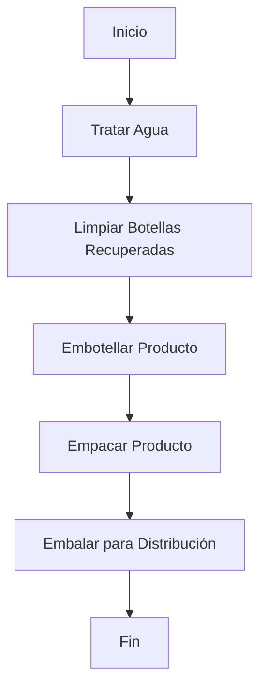

# Modulo 1 : Introducción a la automatización de manufactura

El presente módulo aborda el análisis de una arquitectura de automatización industrial estructurada bajo el estándar ISA-95, mediante la evaluación de la línea de producción a partir de la pirámide de automatización, con el propósito de determinar qué capas se encuentran cubiertas y qué elementos componen cada una de ellas. Posteriormente, se establecen las etapas del proceso de producción, construyendo un esquema conceptual que servirá como base para el planteamiento de los diagramas a desarrollar en el [Módulo 2](https://github.com/NicolasDavila2001/APM-20261S/tree/main/Modulo_2). El módulo concluye con la presentación de los datos iniciales recopilados durante la visita técnica realizada a la planta de FEMSA Coca-Cola, complementados con referencias de la industria del envasado (fabricantes de línea como Krones, KHS y Sidel, y plantas embotelladoras publicadas) para dar coherencia a los valores donde la información de campo fue insuficiente. Estos datos constituyen el punto de partida para el análisis y desarrollo de los módulos subsiguientes y la propuesta de automatización final.

  

Durante la visita técnica a la planta de FEMSA Coca-Cola, se pudo determinar que en toda la linea de produccion 
                        estan cubiertos los niveles 0, 1 y 2; con esta información se espera que alcance del proyecto por minimo pueda cubrir hasta la de gestion de operacioenes de manufactura (MES). A continuación se describen los elementos identificados en cada nivel de la pirámide.

| Nivel | Elementos |
| :--- | :--- |
| 0| Sensores detectores,Bombas hidraulicas,Motores electricos,variadores de velocidad |
| 1 | Controladores lógicos, sistemas de control discretos y regulatorio |
| 2 | Sistemas de supervisión sobre líneas |

## Etapas del Proceso de Produccion de bebidas

Se presenta un diagrama de flujo superfical sobre el proceso de embotellamiento de bebidas el cual muestra el orden de las etapas identificadas en la visita tecnica y complementada con investigacion por parte del equipo.

Para ver el desarrollo del VSM , Diagrama DOP,layaouts y calculo de indicadores dirigirse al [Modulo 2](https://github.com/NicolasDavila2001/APM-20261S/tree/main/Modulo_2)

## Datos Establecidos segun investigación y visita Técnica 

## Datos Importantes de la Visita Técnica

### Líneas y Productos

| Linea | Producto |
| :--- | :--- |
| 1 | Coca Cola 237 mL (retornable) |
| 2 | 350 mL distintos productos (retornable) |
| 3 | 2L (retornable) |
| 5 | No retornables (distintos tamaños) |
| 6 | Latas |
| 7 | Agua saborizada (Brisa) |

---

### Velocidades de Líneas

| Línea | Velocidad |
| :--- | :--- |
| Línea 1 (237 mL) | 38.000 botellas/h |
| Línea 2 (350 mL) | 30.000 botellas/h |
| Línea 3 (2 L) | 12.000 botellas/h |

A mayor volumen de envase, menor es la velocidad alcanzable por la llenadora (más líquido a dosificar, envase más pesado y de manejo más lento), por lo que la línea de menor formato (237 mL) es la más rápida y la de mayor formato (2 L) la más lenta. Estos valores se ajustaron tomando como referencia velocidades reales publicadas de líneas de envase retornable de tamaño comparable (líneas de vidrio retornable de gran formato en el rango de 8.000-15.000 botellas/h, frente a llenadoras retornables de formato pequeño que alcanzan 40.000-55.000 botellas/h).

---

### Tiempo Total de Proceso

| Descripción | Tiempo |
| :--- | :--- |
| Tiempo total del proceso (dock-to-dock, Línea 3) | 90 - 105 minutos |
| Tiempo falla promedio | 21 minutos |
| Tiempo mantenimiento promedio | 20 minutos |

El tiempo total del proceso corresponde al tránsito completo del producto por la línea, incluyendo las esperas y acumulaciones (buffers) entre etapas — por eso es mayor que la simple suma de los tiempos de proceso activo de cada máquina que se detalla a continuación.

---

### Tiempos Estimados por Etapa de Proceso (Línea 3)

| Etapa del Proceso | Tiempo Estimado |
| :--- | :--- |
| **Lavado y preparación** | 25 min |
| **Llenado y sellado** | 15 s |
| **Etiquetado e inspección** | 15 min |
| **Empaque y paletizado** | 25 min |
| **Tiempo Total Aproximado** | **~65 min** |

Aunque el llenado es, de las cuatro, la etapa con menor tiempo de permanencia por botella, sigue siendo el **cuello de botella de la línea** — no porque tarde más, sino porque su capacidad de producción por hora (determinada por el número de válvulas de la llenadora) es la más baja de las cuatro etapas, y es esa tasa la que termina marcando el ritmo de toda la línea.

Tomando la velocidad corregida de la Línea 3 (12.000 botellas/hora) y un turno de 8 horas, se asume una producción de alrededor de **96.000 botellas por turno**.

## Referencias de Busqueda 
- https://www.youtube.com/watch?v=1VRI_r-YMjI
- https://web.facebook.com/watch/?v=521596619874703
- Referencias de velocidades y tiempos de llenado de fabricantes de línea (Krones, KHS, Sidel) y plantas embotelladoras Coca-Cola FEMSA publicadas, usadas para dar coherencia a los valores donde la visita técnica no alcanzó a precisar el dato.