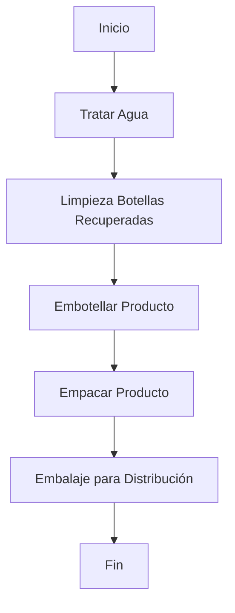

# Modulo 1 : Introducción a la automatización de manufactura

El presente módulo aborda el análisis de una arquitectura de automatización industrial estructurada bajo el estándar ISA-95, mediante la evaluación de la línea de producción a partir de la pirámide de automatización, con el propósito de determinar qué capas se encuentran cubiertas y qué elementos componen cada una de ellas. Posteriormente, se establecen las etapas del proceso de producción, construyendo un esquema conceptual que servirá como base para el planteamiento de los diagramas a desarrollar en el [Módulo 2](https://github.com/NicolasDavila2001/APM-20261S/tree/main/Modulo_2). El módulo concluye con la presentación de los datos iniciales recopilados durante la visita técnica realizada a la planta de FEMSA Coca-Cola, los cuales constituyen el punto de partida para el análisis y desarrollo de los módulos subsiguientes y la propuesta de automatizacion final.

  

## Etapas del Proceso de Produccion de bebidas

Se presenta un diagrama de flujo superfical sobre el proceso de embotellamiento de bebidas el cual muestra el orden de las etapas identificadas en la visita tecnica y complementada con investigacion por parte del equipo.

Para ver el desarrollo del VSM , Diagrama DOP,layaouts y calculo de indicadores dirigirse al [Modulo 2](https://github.com/NicolasDavila2001/APM-20261S/tree/main/Modulo_2)

## Datos Importantes de la Visita Técnica

<table>
  <tr>
    <th>Categoría</th>
    <th>Detalle</th>
  </tr>

  <tr>
    <td><b>Líneas y productos</b></td>
    <td align="left">
      1. Coca Cola 237 mL (retornable) 
      2. 350 mL distintos productos (retornable) 
      3. 2L (retornable) 
      4. No retornables (distintos tamaños) 
      5. Latas 
      6. Agua saborizada (Brisa)
    </td>
  </tr>

  <tr>
    <td><b>Velocidades de líneas</b></td>
    <td>15k/h, 60k/h, 52k/h</td>
  </tr>

  <tr>
    <td><b>Tiempo total de proceso</b></td>
    <td>90 - 105 minutos (desde entrada hasta salida)</td>
  </tr>

  <tr>
    <td><b>Tiempo de proceso - Línea 3</b></td>
    <td>25 - 40 - 25 - 25 min (llenadora = 40 min)</td>
  </tr>

  <tr>
    <td><b>Paradas promedio</b></td>
    <td>
      Falla: 21 min 
      Mantenimiento: 17 min
    </td>
  </tr>

</table>

## Referencias de Busqueda 
