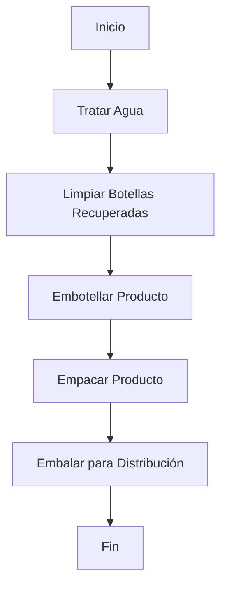

# Modulo 1 : Introducción a la automatización de manufactura

El presente módulo aborda el análisis de una arquitectura de automatización industrial estructurada bajo el estándar ISA-95, mediante la evaluación de la línea de producción a partir de la pirámide de automatización, con el propósito de determinar qué capas se encuentran cubiertas y qué elementos componen cada una de ellas. Posteriormente, se establecen las etapas del proceso de producción, construyendo un esquema conceptual que servirá como base para el planteamiento de los diagramas a desarrollar en el [Módulo 2](https://github.com/NicolasDavila2001/APM-20261S/tree/main/Modulo_2). El módulo concluye con la presentación de los datos iniciales recopilados durante la visita técnica realizada a la planta de FEMSA Coca-Cola, los cuales constituyen el punto de partida para el análisis y desarrollo de los módulos subsiguientes y la propuesta de automatizacion final.

  

## Etapas del Proceso de Produccion de bebidas

Se presenta un diagrama de flujo superfical sobre el proceso de embotellamiento de bebidas el cual muestra el orden de las etapas identificadas en la visita tecnica y complementada con investigacion por parte del equipo.

Para ver el desarrollo del VSM , Diagrama DOP,layaouts y calculo de indicadores dirigirse al [Modulo 2](https://github.com/NicolasDavila2001/APM-20261S/tree/main/Modulo_2)

## Datos Establecidos segun investigación y visita Técnica 

## Datos Importantes de la Visita Técnica

### Líneas y Productos

| Linea | Producto |
| :--- | :--- |
| 1 | Coca Cola 237 mL (retornable) |
| 2 | 350 mL distintos productos (retornable) |
| 3 | 2L (retornable) |
| 5 | No retornables (distintos tamaños) |
| 6 | Latas |
| 7 | Agua saborizada (Brisa) |

---

### Velocidades de Líneas

| Línea | Velocidad |
| :--- | :--- |
| Línea 1 | 15k/h |
| Línea 2 | 60k/h |
| Línea 3 | 52k/h |

---

### Tiempo Total de Proceso

| Descripción | Tiempo |
| :--- | :--- |
| Tiempo total del proceso | 90 - 105 minutos |
| Tiempo falla promedio|  21 minutos |
| Tiempo mantenimiento promedio|  17 - 30 minutos |

---

### Tiempos Estimados por Etapa de Proceso (Línea 3)

| Etapa del Proceso | Tiempo Estimado (min) |
| :--- | :--- |
| **Lavado y preparación** | 25 |
| **Llenado y sellado** | 40 |
| **Etiquetado e inspección** | 15 |
| **Empaque y paletizado** | 25 |
| **Tiempo Total Aproximado** | **105** |

"Llenado y sellado" con 40 minutos representa el cuello de botella del sistema y determina la velocidad de la operación
## Referencias de Busqueda 
- https://www.youtube.com/watch?v=1VRI_r-YMjI
- https://web.facebook.com/watch/?v=521596619874703

# Primera aproximación de indicadores y parámetros de producción 

Para el análisis de los indicadores de producción se tomó como referencia la línea de producción número 3 de botellas retornables de 2 L.

## Datos del proceso:

La siguiente información fue obtenida durante la visita a la planta de producción de FEMSA-Coca Cola:

- **Capacidad de producción de la línea:** 52.000 botellas/h.
- **Tiempo total del proceso:** 90-105 min.
- **Turno de trabajo:** 8 h (28800 s).
- **Etapas principales del proceso de producción:**

| Etapa | Tiempo (min) |
|------|-------------|
| Lavado y preparación | 25 |
| Llenado | 40 |
| Etiquetado e inspección | 15 |
| Empaque y paletizado | 25 |

Por otra parte, para el desarrollo del taller se asumió una producción por turno de alrededor de **416.000 botellas por turno.**

---

## Takt Time:

Takt = TD / D

donde  

- TD = Tiempo disponible  
- D = Demanda  

Si la demanda coincide con la capacidad de la línea, se tiene que:

Takt = 28.800 / 416.000 = 0.069 s/botella

Esto se puede interpretar como que se requiere producir una botella aproximadamente cada **0.7 segundos** para satisfacer la demanda.

---

## Tiempo de ciclo (Tc):
	
El tiempo de ciclo por unidad puede calcularse como:

Tc = Toperación / Q = 3.600 / 52.000 = 0.069 s

---

## Tiempo de alistamiento (Tsu):

Durante la visita no se reportó el valor exacto de este tiempo, que corresponde al tiempo requerido para preparar la línea antes de producir un lote, por lo que se realiza una estimación basada en operaciones típicas de embotelladoras.

Tsu ≈ 20 min

Esto incluye actividades como:

- Cambio de referencia  
- Ajustes de etiquetado  
- Limpieza de la línea  

---

## Tiempo de producción (Rp):

Definida como número de unidades producida por hora, se tiene que:

Rp = 52.000 botellas / h

---

## Capacidad de producción (PC):

Se tiene que:

PC = n * S * H * Rp

donde  

- n = número de estaciones  
- S = turnos por semana  
- H = horas por turno  

Por lo que  

PC = 4 * 7 * 8 * 52.000 = 11'648.000 botellas/semana

---

## Manufacturing Lead Time (MLT):

Se define como el tiempo total desde el inicio hasta la finalización de la fabricación, como no tenemos un valor exacto, y solo contamos con un estimado de entre **90-105 minutos** para el tiempo total de producción, se realizó un promedio de forma que:

MLT ≈ 98 min

---

## Overall Equipment Effectiveness (OEE):

Se tiene que:

OEE = A * PE * Q

donde  

- A = disponibilidad (valor típico industrial estimado de 0.9)  
- PE = eficiencia de desempeño (se estima un valor de 0.95 para una línea de producción automatizada)  
- Q = tasa de calidad (se toma un valor de 0.99 como valor típico de embotellado)  

Por lo que se tiene:

OEE = 0.90 * 0.95 * 0.99 = 0.846 = 84.6 %
