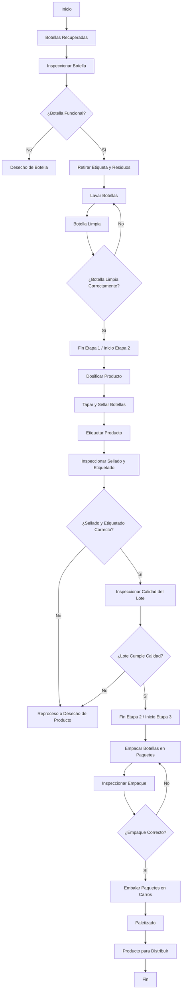
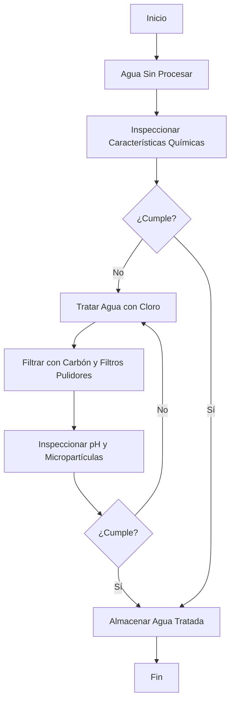
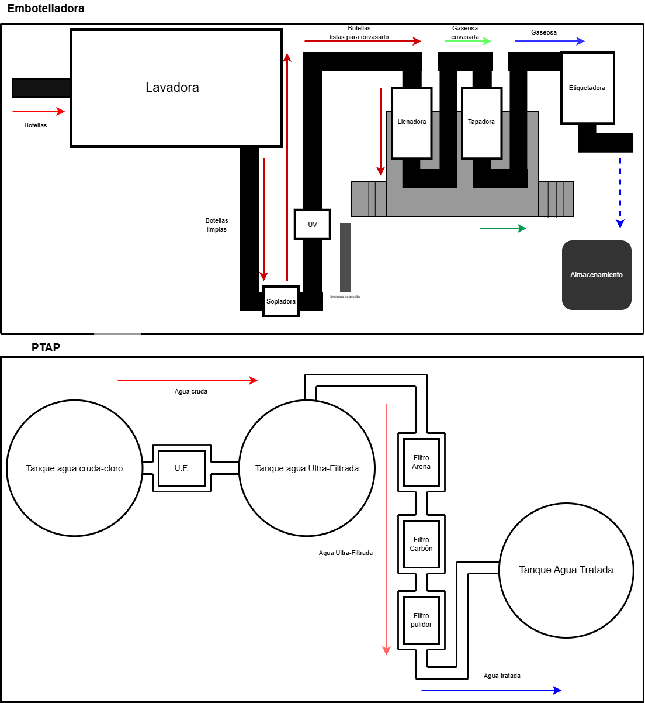

# Modulo 2 : Gestión de producción
En el presente módulo se aborda de manera integral el estudio del proceso de embotellamiento analizado en el [modulo 1](https://github.com/NicolasDavila2001/APM-20261S/tree/main/Modulo_1), a partir de la información investigada y recopilada durante una visita técnica. Se presentan herramientas clave de análisis como el diagrama de operaciones de proceso, el diagrama de análisis, el layout,flujo de materiales y el Value Stream Mapping (VSM), Adicional se hace el calculo de indicadores  y parametros de produccion  de la planta inicial los cuales son la base para presentar la propuesta de automatización para mejorar estos.Adicionalmente La propuesta final se enfoca únicamente en el proceso de producción de bebidas. El tratamiento de agua se incluye en este módulo debido a la relevancia que se le atribuyó durante la visita técnica, sin que forme parte del alcance de la propuesta.

## Diagrama de Operaciones de Proceso 
Se presentan los diagramas de operaciones de proceso de dos etapas importantes para la produccion de bebida el tratamiento de agua y producion de bebidas con sus respectivas operaciones para tener mejor compresión del flujo de trabajo.
### Diagrama de operaciones de Proceso

### Diagrama de Tratamiento de Agua

*** Nota *** Para ver los diagramas DOP con nomenclatura revisar [D_DOP](./Diagrama_DOP.pdf)

## Diagrama de Análsis de proceso
## Distribución de Planta (Layout)

Esta sección vincula los indicadores de producción con la organización física de la maquinaria. El diseño permite visualizar cómo el espacio disponible en la planta de FEMSA condiciona los tiempos y el flujo de los materiales.

#### 1. Línea 3: Envase Retornable (Vidrio)
La distribución de esta línea sigue un **flujo circular**. El proceso comienza con la recepción de envases vacíos que deben pasar por una limpieza profunda antes de ser reutilizados. 

* **Lavado y Preparación:** Es la etapa inicial de desinfección.
* **Llenado y Sellado:** Es el núcleo de la planta y el punto que determina la velocidad de toda la línea (cuello de botella).
* **Inspección:** Se realiza de forma electrónica tras el lavado y el llenado para garantizar la inocuidad.

#### 2. Planta de Tratamiento de Agua Potable (PTAP)
Es el sistema de soporte encargado de procesar el insumo principal. Su diseño es **lineal**, transformando el agua cruda en agua tratada mediante filtración y desinfección, enviándola directamente a la línea de envasado para la mezcla del jarabe.

> **Nota:** La imagen superior integra la vista de planta de la Línea 3 y la infraestructura de la PTAP, facilitando la comprensión del flujo de materiales desde el tratamiento del recurso hídrico hasta el paletizado final.
## Diagrama VSM (Value Stream Mapping) 
## Indicadores y Parámetros de Producción (Línea 3 - Envase retornable 2L)
Usando la informacion obtenida en la vista tecnica e investigacion con otras fuentes ([modulo 1](https://github.com/NicolasDavila2001/APM-20261S/tree/main/Modulo_1))se obtuvieron los siguientes valores.

| Indicador | Definición / Fórmula | Valor Calculado |
| :--- | :--- | :--- |
| **Takt Time** | Tiempo requerido para producir una unidad y satisfacer la demanda. | **0.069 s/botella** |
| **Tiempo de ciclo (Tc)** | Tiempo de operación por unidad producida. | **0.069 s** |
| **Tiempo de alistamiento (Tsu)**| Tiempo requerido para preparar la línea (cambio de referencia, limpieza). | **20 min** |
| **Tasa de producción (Rp)** | Número de unidades producidas por hora. | **52.000 botellas/h** |
| **Capacidad (PC)** | Capacidad total (turnos × horas × estaciones × tasa de producción). | **11.648.000 botellas/sem** |
| **Lead Time (MLT)** | Tiempo total desde el inicio hasta la finalización de la fabricación. | **98 min** |
| **OEE** | Efectividad Total de los Equipos (Disponibilidad × Eficiencia × Calidad). | **84.6 %** |

se estima un valor de 0.95 para una línea de producción automatizada y se toma un valor de 0.99 como valor típico de embotellado. Seria lo ideal y se deconocen estos valores reales. 

**Nota** Para conocer la manera como se calcularon cada uno de los indicadores remitirse a [Talle 1](./Taller1.pdf) 

