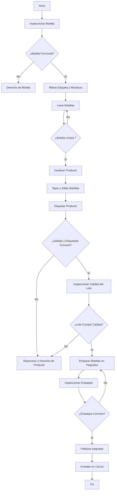
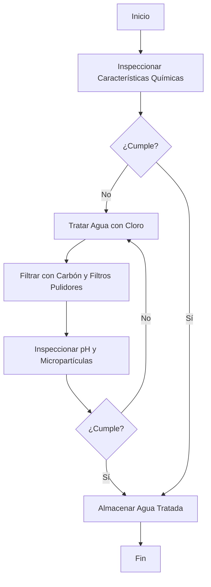

# Modulo 2 : Gestión de producción

En el presente módulo se aborda de manera integral el estudio del proceso de 
                embotellamiento presentado en el [Modulo 1](https://github.com/NicolasDavila2001/APM-20261S/tree/main/Modulo_1), a partir de la información 
                investigada y recopilada durante la visita técnica. Se presentan herramientas clave de análisis como el diagrama de 
                operaciones de proceso, el diagrama de análisis, el layout,flujo de materiales y el Value Stream Mapping (VSM) de la planta inicial, Ademas
                se hace el calculo de indicadores y parametros de produccion de la planta, los cuales son la base para presentar 
                la propuesta de automatización.Cabe resaltar La propuesta final se enfoca únicamente en el proceso de producción 
                de bebidas. El tratamiento de agua se incluye en este módulo debido a la relevancia que se le atribuyó durante la visita técnica, sin 
                que forme parte del alcance de la propuesta.

## Diagrama de Operaciones de Proceso 
Se presentan los diagramas de operaciones de proceso de dos etapas importantes para la produccion de bebidas, el tratamiento de agua y producion de bebidas con sus respectivas operaciones para tener mejor compresión del flujo de trabajo.
### Diagrama de operaciones de Proceso

### Diagrama de Tratamiento de Agua

>***Nota*** Para ver los diagramas DOP con nomenclatura revisar [D_DOP](./Diagrama_DOP.pdf)

## Diagrama de Análsis de proceso
## Distribución de Planta (Layout)

Esta sección vincula los indicadores de producción con la organización física de la maquinaria. El diseño permite visualizar cómo el espacio disponible en la planta de FEMSA condiciona los tiempos y el flujo de los materiales.

#### 1. Línea 3: Envase Retornable (Vidrio)
La distribución de esta línea sigue un **flujo circular**. El proceso comienza con la recepción de envases vacíos que deben pasar por una limpieza profunda antes de ser reutilizados. 

* **Lavado y Preparación:** Es la etapa inicial de desinfección.
* **Llenado y Sellado:** Es el núcleo de la planta y el punto que determina la velocidad de toda la línea (cuello de botella), no por su tiempo de permanencia por botella —que es el más corto de la línea— sino por su capacidad de producción por hora.
* **Inspección:** Se realiza de forma electrónica tras el lavado y el llenado para garantizar la inocuidad.

#### 2. Planta de Tratamiento de Agua Potable (PTAP)
Es el sistema de soporte encargado de procesar el insumo principal. Su diseño es **lineal**, transformando el agua cruda en agua tratada mediante filtración y desinfección, enviándola directamente a la línea de envasado para la mezcla del jarabe.

> **Nota:** La imagen superior integra la vista de planta de la Línea 3 y la infraestructura de la PTAP, facilitando la comprensión del flujo de materiales desde el tratamiento del recurso hídrico hasta el paletizado final.
## Diagrama VSM (Value Stream Mapping) 
## Indicadores y Parámetros de Producción (Línea 3 - Envase retornable 2L)
Usando la informacion obtenida en la vista tecnica, complementada y corregida con referencias de la industria del envasado ([modulo 1](https://github.com/NicolasDavila2001/APM-20261S/tree/main/Modulo_1)), se obtuvieron los siguientes valores.

---

## Takt Time:

Takt = TD / D

donde  

- TD = Tiempo disponible  
- D = Demanda  

Si la demanda coincide con la capacidad de la línea, se tiene que:

Takt = 28.800 / 96.000 = 0.3 s/botella

Esto se puede interpretar como que se requiere producir una botella aproximadamente cada **0.3 segundos** para satisfacer la demanda.

---

## Tiempo de ciclo (Tc):
	
El tiempo de ciclo por unidad puede calcularse como:

Tc = Toperación / Q = 3.600 / 12.000 = 0.3 s

---

## Tiempo de alistamiento (Tsu):

Este tiempo corresponde a lo requerido para preparar la línea antes de producir un lote (cambio de referencia, ajustes de etiquetado, limpieza de línea). Dado que la línea todavía opera en los niveles 0-2 de la pirámide ISA-95 (ver [Módulo 1](https://github.com/NicolasDavila2001/APM-20261S/tree/main/Modulo_1)), es decir, sin una gestión de cambios de formato optimizada:

Tsu (estado actual) ≈ 60 min

Tsu (objetivo) ≈ 15-20 min

---

## Tiempo de producción (Rp):

Definida como número de unidades producida por hora, se tiene que:

Rp = 12.000 botellas / h

---

## Capacidad de producción (PC):

Se tiene que:

PC = n * S * H * Rp

donde  

- n = número de estaciones  
- S = turnos por semana  
- H = horas por turno  

Por lo que  

PC = 1 * 7 * 8 * 12.000 = 672.000 botellas/semana

---

## Manufacturing Lead Time (MLT):

Se define como el tiempo total desde el inicio hasta la finalización de la fabricación (tiempo dock-to-dock, incluyendo esperas y acumulación entre etapas). Tomando el rango de 90-105 minutos reportado para el tránsito completo del producto por la línea (ver [Módulo 1](https://github.com/NicolasDavila2001/APM-20261S/tree/main/Modulo_1)), se promedia de forma que:

MLT ≈ 98 min

Este valor es mayor que la suma de los tiempos de proceso activo de cada etapa (~65 min, ver Módulo 1) porque incluye las esperas y acumulaciones entre estaciones, que son normales en cualquier línea continua.

---

## Overall Equipment Effectiveness (OEE):

Se tiene que:

OEE = A * PE * Q

donde  

A = disponibilidad  
PE = eficiencia de desempeño  
Q = tasa de calidad  

Se calculan dos escenarios, porque la planta analizada todavía no está automatizada:

**OEE actual (línea base, antes de automatizar):**

A = 0.90 (con base en el tiempo de falla y mantenimiento reportados: ~38-51 min de paro sobre un turno de 480 min)
PE = 0.82 
Q = 0.99 (valor típico de embotellado)

OEE actual = 0.90 * 0.82 * 0.99 = 0.731 = **73.1 %**

**OEE objetivo (una vez implementada la propuesta de automatización):**

A = 0.90
PE = 0.95 
Q = 0.99

OEE objetivo = 0.90 * 0.95 * 0.99 = 0.846 = **84.6 %**

| Indicador | Definición / Fórmula | Valor Calculado |
| :--- | :--- | :--- |
| **Takt Time** | Tiempo requerido para producir una unidad y satisfacer la demanda. | **0.3 s/botella** |
| **Tiempo de ciclo (Tc)** | Tiempo de operación por unidad producida. | **0.3 s** |
| **Tiempo de alistamiento (Tsu)**| Tiempo requerido para preparar la línea (cambio de referencia, limpieza). | **60 min (actual) / 15-20 min (objetivo)** |
| **Tasa de producción (Rp)** | Número de unidades producidas por hora. | **12.000 botellas/h** |
| **Capacidad (PC)** | Capacidad total (turnos × horas × estaciones × tasa de producción). | **672.000 botellas/sem** |
| **Lead Time (MLT)** | Tiempo total desde el inicio hasta la finalización de la fabricación. | **98 min** |
| **OEE** | Efectividad Total de los Equipos (Disponibilidad × Eficiencia × Calidad). | **73.1 % (actual) / 84.6 % (objetivo)** |

