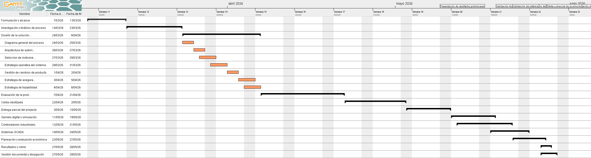

# Modulo 3: Planeación de proyectos
La planeación de proyectos es una etapa fundamental para garantizar el éxito de cualquier iniciativa, ya que permite estructurar de manera ordenada los recursos, los tiempos y las responsabilidades involucradas. En este módulo se abordan las principales herramientas y metodologías utilizadas en la gestión de proyectos, donde se utilizo la metodología EDT. Dando como resultado la definición de distintas herramientas de análisis como EDT, Cronograma (Diagrama de Gantt),etc

## Modelo de negocios

  

## Diagrama de EDT
El EDT es una herramienta de análisis que permite representar gráficamente cada una de las tareas que componen las etapas
                    de un proyecto y asi poder facilitar la comprensión de las actividades necesarias para cumplir los objetivos de este, por ello no solo se realiza el EDT del proyecto si no 
                    tambien el EDT del proceso con el fin de tener un mejor conocimiento de las distintas tareas que componene cada una de las etapas de este.
### EDT de proceso 

  

### EDT de proyecto

  

> **Nota** Para mayor comprension de las actividades revisar la [documentacion](Documentacion_EDTs.pdf) de los edts  y los EDTs [Proceso](EDT_Proceso.pdf) o [Proyecto](EDT_Proyecto.pdf)

## Cronograma y diagrama de Gantt

La planificación temporal se estructuró en un diagrama de Gantt que abarca del **7 de marzo** al **30 de mayo de 2026**. Debido a la complejidad del proyecto (89 actividades), la imagen a continuación presenta una **versión colapsada** que muestra únicamente los 12 niveles principales de la EDT, y la fase que se esta realizando actualmente. Esta vista permite identificar rápidamente la secuencia macro, la ruta crítica y el cumplimiento de las fases de diseño, simulación y control.

> **Nota:** Para una revisión a fondo de las 89 tareas, incluyendo fechas de inicio/fin de cada subítem, predecesoras y duraciones específicas, se anexa la **versión de detalle** en el siguiente enlace: [Cronograma Detallado (PDF)](Gantt_APM_Def.pdf).
> 
## Análisis de Precios Unitarios (APU)

## Flujo de caja

## Evaluación económica ampliada

El Análisis de Precios Unitarios y el flujo de caja anteriores fueron el primer planteamiento del presupuesto del
proyecto. A partir de ahí se hizo una revisión más profunda para:

- Corregir los equipos presupuestados para que coincidan con lo que realmente se implementó en los Módulos 4-6 (el
  PLC y el HMI presupuestados originalmente eran de una marca distinta a la que finalmente se programó, y la línea
  de producto presupuestada no era la correcta).
- Reemplazar la tarifa de mano de obra plana ($30.000-60.000 COP/hora) por el salario real de mercado de un
  Ingeniero de Automatización en Colombia, aplicado a los 6 integrantes del equipo con un cronograma de ejecución
  realista para un proyecto industrial (no el calendario del semestre académico).
- Agregar los costos operativos anuales (OPEX) y una evaluación completa de rentabilidad — VAN, TIR, Payback y
  ROI — que el planteamiento inicial no incluía.

Este análisis ampliado está en el archivo
[`Evaluacion_Economica_def.xlsx`](Evaluacion_Economica_def.xlsx), un modelo
editable (con fórmulas) organizado en hojas: *Supuestos*, *Nomina*, *CAPEX*, *OPEX*, *Beneficios*, *FlujoCaja* y
*Resumen*.

### Resultados principales

| Indicador | Valor |
|---|---|
| CAPEX total (inversión inicial) | $426.632.750 COP |
| OPEX anual | $32.358.250 COP |
| Beneficios ciertos anuales (ahorro de mano de obra) | $124.320.000 COP |
| Payback simple | 4,64 años |
| VAN (@ 15% anual) | -$118.362.701 COP |
| TIR | 2,5% |
| ROI al horizonte de evaluación (5 años) | 7,8% |

Contando únicamente el ahorro de mano de obra por paletizado automatizado, el proyecto recupera la inversión dentro
del horizonte de evaluación, pero no supera la tasa de descuento exigida (15% anual). El argumento financiero más
fuerte del proyecto es el beneficio potencial de cerrar la brecha de OEE (73,1% → 84,6%,), estimado en
**$4.581.158.400 COP/año** — este valor se muestra aparte porque depende de que el mercado absorba la producción
adicional liberada, algo que no se puede confirmar por sí solo.

> **Nota:** todos los supuestos del modelo (TRM, salarios, tasa de descuento, tiempo de dedicación del equipo,
> precios de equipos, etc.) están centralizados y documentados en la hoja *Supuestos* del Excel, y son editables.

<!-- 
## Matriz de adquisiciones
## Matriz de riesgos
## Matriz de comunicaciones 
## Matriz de responsabilidades
-->