# Modulo 3: Planeación de proyectos
La planeación de proyectos es una etapa fundamental para garantizar el éxito de cualquier iniciativa, ya que permite estructurar de manera ordenada los recursos, los tiempos y las responsabilidades involucradas. En este módulo se abordan las principales herramientas y metodologías utilizadas en la gestión de proyectos, donde se utilizo la metodología EDT. Dando como resultado la definición de distintas herramientas de análisis como EDT, Cronograma (Diagrama de Gantt),etc

## Diagrama de EDT
> **Nota** Se realizo el EDT de proceso de produccion con el fin de tener un mejor conocimiento de las distintas tareas que componene cada una de las etapas del procesos de producir bebidas
### EDT de proceso 

```mermaid
graph TD
    N[EDT de Producción] --> O[1. Recepción de Insumos]
    N --> P[2. Almacenamiento y Preparación]
    N --> Q[3. Formulación]
    N --> R[4. Tratamientos de Proceso]
    N --> S[5. Alimentación de Envases]
    N --> T[6. Acondicionamiento Envases]
    N --> U[7. Llenado]
    N --> V[8. Tapado o Sellado]
    N --> W[9. Control de Calidad en Línea]
    N --> X[10. Etiquetado y Codificación]
    N --> Y[11. Empaque Secundario]
    N --> Z[12. Paletizado / Robotizado]
    N --> AA[13. Almacenamiento Final]
    N --> AB[14. Despacho]
    N --> AC[15. Set-up y Cambios de Producto]
    N --> AD[16. Mantenimiento por Fallas]
    N --> AE[17. Supervisión y Trazabilidad]

    O --> O1[1.1 Materias Primas]
    O --> O2[1.2 Envases]
    O --> O3[1.3 Tapas y Etiquetas]
    O --> O4[1.4 Inspección Inicial]
    O --> O5[1.5 Registro de Lotes]

    P --> P1[2.1 Almacenamiento]
    P --> P2[2.2 Alistamiento]
    P --> P3[2.3 Transporte Interno]
    P --> P4[2.4 Verif. Disponibilidad]

    Q --> Q1[3.1 Dosificación]
    Q --> Q2[3.2 Mezcla]
    Q --> Q3[3.3 Receta Producto A]
    Q --> Q4[3.4 Receta Producto B]
    Q --> Q5[3.5 Receta Producto C]
    Q --> Q6[3.6 Ajuste de Parámetros]

    R --> R1[4.1 Calentamiento]
    R --> R2[4.2 Enfriamiento]
    R --> R3[4.3 Carbonatación]
    R --> R4[4.4 Pasteurización]
    R --> R5[4.5 Control de Variables]

    S --> S1[5.1 Ingreso de Envases]
    S --> S2[5.2 Transporte]
    S --> S3[5.3 Posicionamiento]
    S --> S4[5.4 Detección]
    S --> S5[5.5 Rechazo Defectuosos]

    T --> T1[6.1 Lavado]
    T --> T2[6.2 Enjuague]
    T --> T3[6.3 Inspección]

    U --> U1[7.1 Alim. del Producto]
    U --> U2[7.2 Posicionamiento]
    U --> U3[7.3 Dosificación]
    U --> U4[7.4 Verif. de Nivel]
    U --> U5[7.5 Rechazo por Tolerancia]

    V --> V1[8.1 Alim. de Tapas]
    V --> V2[8.2 Cierre]
    V --> V3[8.3 Verificación]
    V --> V4[8.4 Detección de Fugas]

    W --> W1[9.1 Insp. de Llenado]
    W --> W2[9.2 Insp. de Tapa]
    W --> W3[9.3 Inspección Visual]
    W --> W4[9.4 Rechazo]
    W --> W5[9.5 Registro de Calidad]

    X --> X1[10.1 Etiquetado]
    X --> X2[10.2 Codificación]
    X --> X3[10.3 Verificación]
    X --> X4[10.4 Rechazo]

    Y --> Y1[11.1 Agrupación]
    Y --> Y2[11.2 Formación Cajas/Packs]
    Y --> Y3[11.3 Sellado]
    Y --> Y4[11.4 Identificación]

    Z --> Z1[12.1 Recepción]
    Z --> Z2[12.2 Toma por Robot]
    Z --> Z3[12.3 Ubicación]
    Z --> Z4[12.4 Verificación]

    AA --> AA1[13.1 Clasificación]
    AA --> AA2[13.2 Inventario]
    AA --> AA3[13.3 Consolidación]

    AB --> AB1[14.1 Prep. de Pedido]
    AB --> AB2[14.2 Verificación]
    AB --> AB3[14.3 Cargue]
    AB --> AB4[14.4 Registro de Salida]

    AC --> AC1[15.1 Parada]
    AC --> AC2[15.2 Limpieza]
    AC --> AC3[15.3 Cambio de Formato]
    AC --> AC4[15.4 Cambio de Receta]
    AC --> AC5[15.5 Ajustes]
    AC --> AC6[15.6 Validación]

    AD --> AD1[16.1 Detección]
    AD --> AD2[16.2 Diagnóstico]
    AD --> AD3[16.3 Reparación]
    AD --> AD4[16.4 Prueba]
    AD --> AD5[16.5 Registro]

    AE --> AE1[17.1 Monitoreo]
    AE --> AE2[17.2 Registro de Producción]
    AE --> AE3[17.3 Alarmas]
    AE --> AE4[17.4 Datos para OEE]
    AE --> AE5[17.5 Visualización SCADA]
```

### EDT de proyecto

> **Nota** Para mayor comprension de las actividades revisar la documentacion de los edts en [drive](https://drive.google.com/drive/folders/1u4X_VxKKNBwQw5WIbT5CfG8ByEeDgeEC?usp=sharing) y los EDTs [Proceso](EDT_Proceso.pdf) o [Proyecto](EDT_Proyecto.pdf)

## Conograma y diagrama de Gantt
## Presupuesto y flujo de caja

<!-- 
## Matriz de adquisiciones
## Matriz de riesgos
## Matriz de comunicaciones 
## Matriz de responsabilidades
-->

