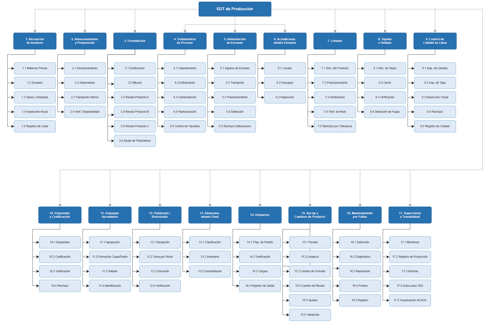
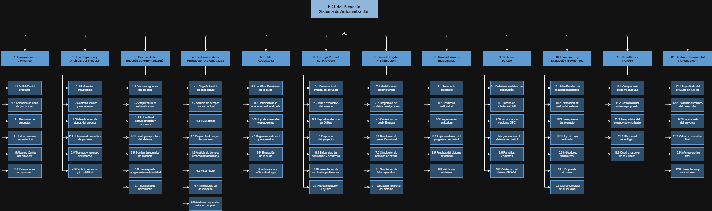
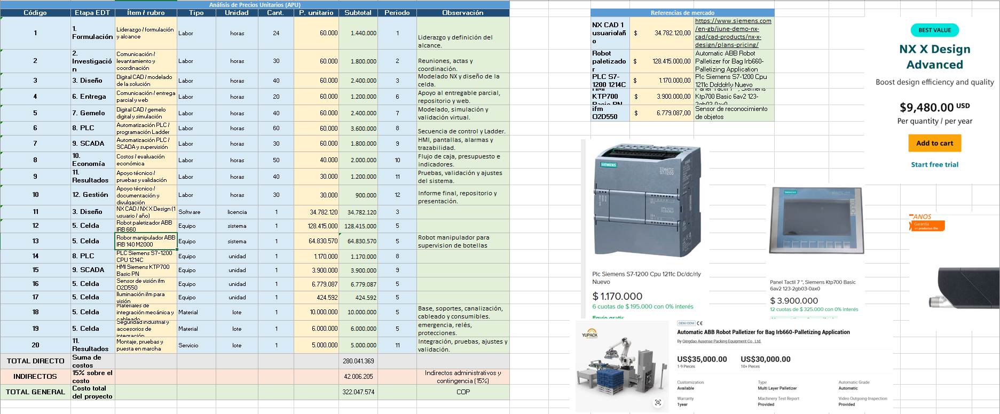
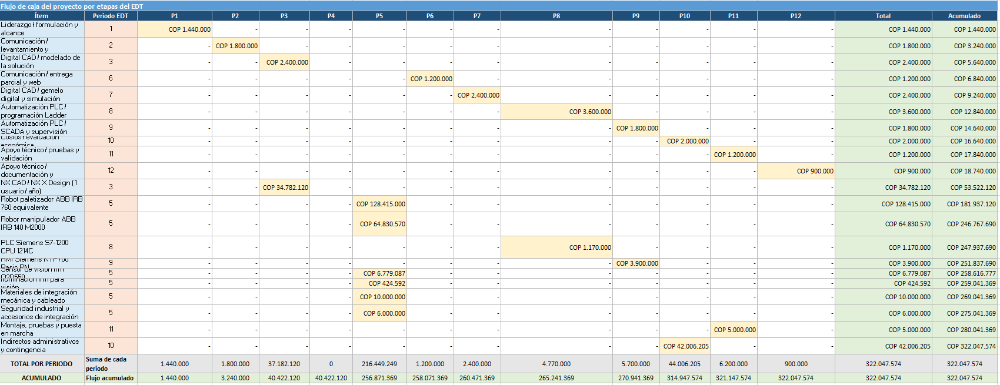

# Modulo 3: Planeación de proyectos
La planeación de proyectos es una etapa fundamental para garantizar el éxito de cualquier iniciativa, ya que permite estructurar de manera ordenada los recursos, los tiempos y las responsabilidades involucradas. En este módulo se abordan las principales herramientas y metodologías utilizadas en la gestión de proyectos, donde se utilizo la metodología EDT. Dando como resultado la definición de distintas herramientas de análisis como EDT, Cronograma (Diagrama de Gantt),etc

## Diagrama de EDT
> **Nota** Se realizo el EDT de proceso de produccion con el fin de tener un mejor conocimiento de las distintas tareas que componene cada una de las etapas del procesos de producir bebidas
### EDT de proceso 

  

### EDT de proyecto

  

> **Nota** Para mayor comprension de las actividades revisar la [documentacion](Documentacion_EDTs.pdf) de los edts  y los EDTs [Proceso](EDT_Proceso.pdf) o [Proyecto](EDT_Proyecto.pdf)

## Cronograma y diagrama de Gantt

La planificación temporal se estructuró en un diagrama de Gantt que abarca del **7 de marzo** al **30 de mayo de 2026**. Debido a la complejidad del proyecto (89 actividades), la imagen a continuación presenta una **versión colapsada** que muestra únicamente los 12 niveles principales de la EDT, y la fase que se esta realizando actualmente. Esta vista permite identificar rápidamente la secuencia macro, la ruta crítica y el cumplimiento de las fases de diseño, simulación y control.

> **Nota:** Para una revisión a fondo de las 89 tareas, incluyendo fechas de inicio/fin de cada subítem, predecesoras y duraciones específicas, se anexa la **versión de detalle** en el siguiente enlace: [Cronograma Detallado (PDF)](Gantt_APM_Def.pdf).
> 
## Análisis de Precios Unitarios (APU)

## Flujo de caja

<!-- 
## Matriz de adquisiciones
## Matriz de riesgos
## Matriz de comunicaciones 
## Matriz de responsabilidades
-->

