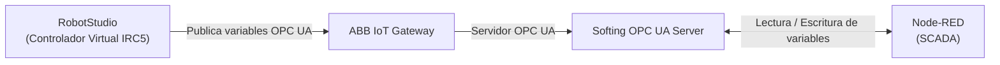
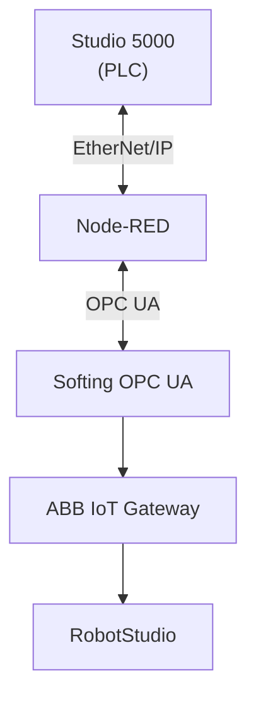
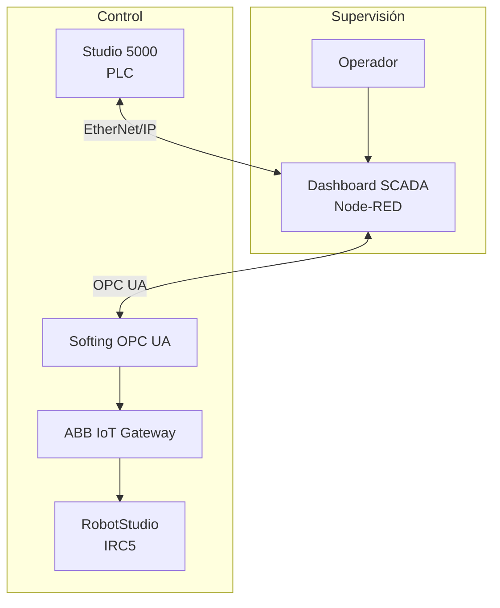

# Celda de manufactura robotizada

## Descripción del módulo

Este módulo corresponde al diseño y simulación de una celda robotizada para el proceso de paletizado de cajas de botellas. El objetivo principal fue desarrollar una solución automatizada capaz de reemplazar las tareas repetitivas que normalmente realiza un operario al final de una línea de producción, donde las cajas deben organizarse sobre un pallet siguiendo un patrón específico.

Durante el desarrollo del proyecto no solo se diseñó el movimiento del robot, sino que también se buscó integrar diferentes tecnologías utilizadas en la industria, como la programación del robot, el control mediante PLC, la supervisión con un sistema SCADA y la implementación de medidas de seguridad para proteger a los operarios y a los equipos.

Toda la celda fue desarrollada en un entorno de simulación, permitiendo validar el funcionamiento antes de una posible implementación física.

---

# Objetivos de la celda robotizada

La propuesta busca cumplir con los siguientes objetivos:

- Automatizar el proceso de paletizado de cajas.
- Reducir los tiempos de ciclo del proceso.
- Disminuir el esfuerzo físico de los operarios.
- Mejorar la repetibilidad y precisión del proceso.
- Integrar el robot con un PLC Siemens y un sistema SCADA.
- Simular el funcionamiento completo de una celda industrial.
- Analizar los riesgos presentes durante la operación y proponer medidas para reducirlos.

---

# Funciones del robot dentro de la línea de producción

Dentro de la línea de producción, el robot industrial cumple varias funciones que permiten automatizar completamente la etapa de paletizado.

Entre ellas se encuentran:

- Recibir las cajas provenientes de la banda transportadora.
- Detectar la presencia de cada caja mediante sensores.
- Tomar las cajas utilizando un efector final diseñado para el proceso.
- Transportarlas desde la banda hasta la zona de almacenamiento.
- Organizar las cajas sobre el pallet siguiendo un patrón de apilado previamente programado.
- Repetir automáticamente el ciclo hasta completar el pallet.
- Esperar la llegada de un nuevo pallet para reiniciar el proceso.

Durante toda la operación el robot trabaja de manera sincronizada con el PLC y con el sistema SCADA, intercambiando señales que permiten controlar el inicio del ciclo, las paradas, el estado de los sensores y las condiciones de seguridad.

---

# Ventajas de implementar una celda robotizada

La automatización mediante robots industriales ofrece diferentes beneficios frente a un proceso manual.

En este proyecto se destacan principalmente los siguientes:

- Incremento de la productividad al disminuir el tiempo requerido para cada ciclo de paletizado.
- Mayor repetibilidad, ya que todas las cajas son ubicadas exactamente en la misma posición.
- Reducción de errores humanos durante el proceso de apilado.
- Disminución de lesiones asociadas al levantamiento repetitivo de cargas.
- Operación continua durante largos periodos sin afectar la calidad del proceso.
- Mayor facilidad para supervisar el sistema mediante herramientas SCADA.
- Posibilidad de modificar fácilmente el patrón de apilado mediante programación, sin realizar cambios mecánicos.

Estas ventajas hacen que este tipo de soluciones sean ampliamente utilizadas en industrias de alimentos, bebidas, logística y manufactura.

---

# Selección del robot

## ABB IRB 660

Para el desarrollo del proyecto se seleccionó el robot ABB IRB 660, debido a que es uno de los robots industriales más utilizados para aplicaciones de paletizado.

La elección se realizó considerando diferentes criterios técnicos.

### Principales razones de selección

- Está diseñado específicamente para procesos de paletizado.
- Posee una alta capacidad de carga, adecuada para manipular varias cajas o cargas pesadas.
- Cuenta con un amplio alcance de trabajo, permitiendo cubrir toda el área de la celda.
- Presenta altas velocidades de operación sin perder precisión.
- Tiene una excelente repetibilidad, característica fundamental en procesos industriales.
- Está preparado para operar continuamente durante largos periodos.
- Reduce significativamente los riesgos ergonómicos para los operarios.
- Se integra fácilmente con PLC Siemens mediante comunicación industrial.
- Puede programarse utilizando RAPID y simularse completamente en RobotStudio.
- Es uno de los robots más utilizados actualmente en aplicaciones de final de línea.

---

# Elementos de la celda

La celda robotizada está compuesta por diferentes elementos que trabajan de manera conjunta.

Los principales componentes del sistema son:

- Robot ABB IRB 660.
- Controlador IRC5.
- PLC Siemens encargado de la lógica de control.
- Sistema SCADA desarrollado en Node-RED.
- Sensores para detectar cajas y condiciones de operación.
- Estación de paletizado.
- Botones de parada de emergencia.

El PLC se encarga de coordinar las señales provenientes de los sensores y enviar las órdenes necesarias al robot, mientras que el SCADA permite visualizar el estado del sistema en tiempo real.

---

# Funcionamiento general

El funcionamiento de la celda puede resumirse de la siguiente manera:

1. El operador inicia el proceso desde el sistema SCADA.
2. El PLC verifica que todas las condiciones de seguridad sean correctas.
3. Cuando una caja llega al final de la banda transportadora, el sensor detecta su presencia.
4. El PLC informa al robot que existe una caja disponible.
5. El robot realiza la secuencia de Pick & Place.
6. La caja es ubicada sobre el pallet siguiendo el patrón programado.
7. El proceso se repite hasta completar el pallet.
8. Una vez finalizado, el sistema queda listo para comenzar un nuevo ciclo.

---

# Evaluación de riesgos

Como parte del diseño de la celda robotizada se realizó una evaluación de riesgos siguiendo los principios establecidos por la **Norma UNE-EN ISO 14121-1:2007**, considerando la identificación de peligros, la estimación del riesgo y la implementación de medidas para reducirlos.

Durante el análisis se identificaron **20 peligros**, incluyendo riesgos mecánicos, eléctricos, ergonómicos, relacionados con el sistema de mando, ruido, vibraciones y condiciones de mantenimiento.

La valoración del riesgo se realizó utilizando una matriz basada en la gravedad del daño y la probabilidad de ocurrencia.

| Nivel de riesgo | Antes de las medidas | Después de las medidas |
| :--- | :---: | :---: |
| Trivial | 0 | 5 |
| Tolerable | 5 | 7 |
| Moderado | 8 | 8 |
| Importante | 6 | 0 |
| Intolerable | 1 | 0 |

Después de implementar las medidas de control, ningún riesgo permaneció clasificado como **Importante** o **Intolerable**. Los riesgos residuales corresponden principalmente a actividades de mantenimiento o intervención dentro de la celda, por lo que requieren procedimientos de trabajo seguros y capacitación del personal.

📄 Documento completo: [Evaluación de Riesgos — Celda Robotizada IRB 660](./Evaluacion_Riesgos_Celda_Robotizada_IRB660.pdf)

---

# Principales riesgos identificados

Entre los riesgos más importantes encontrados durante el análisis se encuentran:

- Colisión entre el robot y el operario.
- Atrapamiento entre el brazo robótico y la estructura de la celda.
- Caída de la carga debido a fallas del efector final.
- Golpes ocasionados por cajas o pallets en movimiento.
- Movimientos inesperados del robot.
- Contacto con equipos energizados.
- Arranque inesperado del sistema.
- Atrapamiento en bandas transportadoras.
- Acceso no autorizado al interior de la celda.

---

# Medidas de seguridad implementadas

Con el fin de reducir los riesgos identificados, se incorporaron diferentes elementos de seguridad tanto físicos como de control.

Entre ellos se encuentran:

- Cerramiento perimetral alrededor de toda la celda.
- Puertas de acceso con enclavamiento de seguridad.
- Botones de parada de emergencia ubicados en puntos estratégicos.
- Sensores para controlar el acceso a zonas peligrosas.
- PLC de seguridad para supervisar funciones críticas.
- Procedimientos seguros para mantenimiento.
- Capacitación del personal.
- Uso obligatorio de elementos de protección personal.
- Supervisión permanente mediante el sistema SCADA.
- Alarmas para informar condiciones anormales del proceso.

---

# Software utilizado

Durante el desarrollo del proyecto se utilizaron diferentes herramientas de ingeniería industrial.

| Software | Función |
|-----------|----------|
| ABB RobotStudio | Simulación y programación del robot |
| RAPID | Programación de movimientos del robot |
| Studio 5000 | Programación del PLC |
| Node-RED | Desarrollo del sistema SCADA |
---

# 🔗 Arquitectura de comunicación

Uno de los principales objetivos del proyecto fue lograr la comunicación entre los diferentes sistemas de automatización para que la celda funcionara de manera coordinada. Para esto se implementaron dos arquitecturas de comunicación diferentes, cada una encargada de una parte específica del proceso.

---

## Comunicación entre RobotStudio y Node-RED

La comunicación entre la simulación del robot y el sistema SCADA se realizó utilizando **ABB IoT Gateway** junto con **Softing OPC UA Server**.

En RobotStudio se configuró el **IoT Gateway**, el cual permite publicar las señales del controlador virtual IRC5 hacia un servidor OPC UA. Posteriormente, **Softing OPC UA Server** actuó como intermediario, exponiendo estas variables para que pudieran ser leídas y escritas desde Node-RED.

Gracias a esta arquitectura fue posible que el sistema SCADA supervisara en tiempo real el estado del robot y enviara comandos de operación sin necesidad de acceder directamente al controlador del robot.

Las principales señales intercambiadas fueron:

- Estado del robot (En marcha, detenido o en espera).
- Botón Start.
- Botón Stop.
- Continue.
- Reset.
- Señales de los sensores virtuales.
- Contador de cajas procesadas.
- Estado del ciclo de paletizado.
- Alarmas generadas por el robot.

Esta comunicación permitió desarrollar un dashboard desde Node-RED donde el operador podía supervisar toda la celda en tiempo real e interactuar con ella mediante una interfaz gráfica.

### Flujo de comunicación

---

## Comunicación entre Studio 5000 y Node-RED

Además del robot, el proyecto incluyó un PLC programado en Studio 5000, encargado de supervisar diferentes condiciones del proceso y generar alarmas dependiendo del estado de la planta.

Gracias a esta conexión el sistema SCADA podía:

- Visualizar el estado de las entradas y salidas del PLC.
- Mostrar alarmas activas.
- Registrar eventos del proceso.
- Enviar comandos de control cuando era necesario.

Una de las funciones implementadas consistía en modificar automáticamente la rutina que debía ejecutar el robot dependiendo de la alarma detectada por el PLC.

Por ejemplo, cuando el PLC identificaba una condición anormal, enviaba una señal a Node-RED indicando el tipo de alarma. Node-RED procesaba esta información y escribía una nueva variable hacia RobotStudio indicando cuál rutina RAPID debía ejecutarse.

De esta forma el robot podía cambiar automáticamente su comportamiento sin necesidad de modificar el programa manualmente.

Algunos ejemplos de estas rutinas fueron:

- Operación normal.
- Pausa del proceso.
- Reanudación del ciclo.
- Rutina de espera.
- Rutina de recuperación después de una falla.
- Reinicio del proceso una vez eliminada la alarma.

Esta arquitectura permitió desacoplar la lógica del PLC de la programación del robot, utilizando Node-RED como intermediario para coordinar ambos sistemas.

### Flujo de comunicación

---

## Integración general del sistema

Finalmente, la arquitectura completa del proyecto quedó conformada por cuatro niveles principales:

Con esta arquitectura fue posible integrar la supervisión del proceso, la lógica de control del PLC y la programación del robot dentro de un mismo sistema. Node-RED actuó como el elemento central de comunicación, permitiendo visualizar el estado de la celda en tiempo real, enviar comandos al robot, registrar alarmas y coordinar el intercambio de información entre el PLC y el controlador virtual del ABB IRB 660.

---

# 📁 Archivos incluidos

| Archivo | Descripción |
|---------|-------------|
| [CeldaRobotizadaChibcho.rspag](./Modulo_4/CeldaRobotizadaChibcho.rspag) | Proyecto completo de RobotStudio. |
| [RapidChibcho.modx](./Modulo_4/RapidChibcho.modx) | Programa del robot escrito en RAPID. |