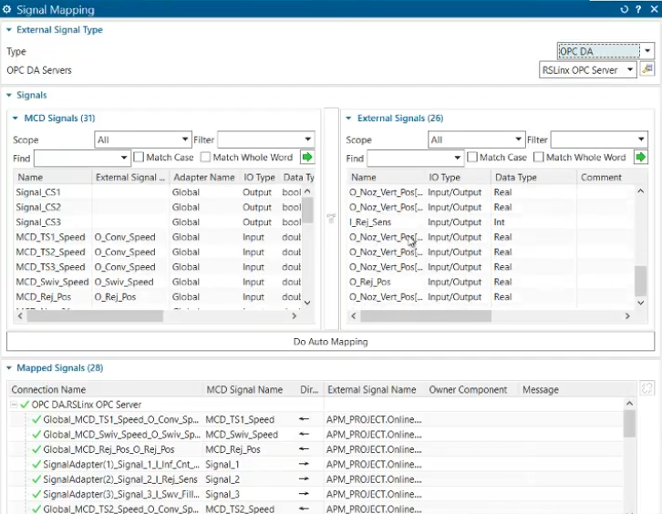
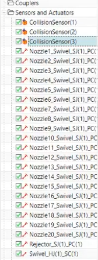
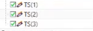

# Simulación en Plant Simulation

## Descripción
Modelo de una planta de bebidas con tres etapas:
1. Tratamiento de aguas

2. Preparación de jarabes

3. Líneas de envasado

### Estadísticas

## Software
Siemens Tecnomatix Plant Simulation

## Contenido
- modelo principal
- imágenes del layout

## Supuestos
- 3 productos
- fallas por MTTR

## Gemelo digital robotizado: integración NX MCD ↔ RSLinx ↔ Studio 5000

Además de la simulación de flujo en Plant Simulation, la llenadora rotativa de 20 boquillas
(programa ladder detallado en el [Módulo 6](../Modulo_6/Readme.md)) se validó como gemelo
digital físico en **NX Mechatronics Concept Designer (MCD)**, comunicado con el controlador
virtual **Studio 5000 (Emulate 5570)** a través de un servidor OPC DA en **RSLinx**.

**Arquitectura de comunicación:**

`Studio 5000 (Emulate 5570)` → `RSLinx OPC Server (OPC DA)` → `Signal Mapping (NX MCD)` → `Physics Navigator (modelo físico)`

**Resumen del Signal Mapping en MCD:**

| Elemento | Cantidad |
|---|---|
| Señales MCD (lado simulación física) | 31 |
| Señales externas (lado RSLinx / PLC) | 26 |
| Señales mapeadas activas | 28 |

**Tabla de señales (extracto representativo):**

| Señal MCD | Dirección | Tag externo (RSLinx / Studio 5000) | Función |
|---|---|---|---|
| MCD_TS1_Speed | PLC → MCD | O_Conv_Speed | Velocidad transportador de entrada (TS1) |
| MCD_TS2_Speed | PLC → MCD | O_Conv_Speed | Velocidad transportador intermedio (TS2) |
| MCD_TS3_Speed | PLC → MCD | O_Conv_Speed | Velocidad transportador de salida (TS3) |
| MCD_Swiv_Speed | PLC → MCD | O_Swiv_Speed | Velocidad de giro del carrusel de llenado |
| MCD_Rej_Pos | PLC → MCD | O_Rej_Pos | Posición del actuador de la estación de rechazo |
| Signal_1 | MCD → PLC | I_Inf_Cnt... | Conteo de botellas en el infeed |
| Signal_2 | MCD → PLC | I_Rej_Sens | Sensor de la estación de rechazo |
| Signal_3 | MCD → PLC | I_Swv_Fill... | Sensor de llenado en boquilla del carrusel |

> Las señales con dirección **PLC → MCD** son setpoints que Studio 5000 escribe y que MCD
> aplica sobre los actuadores del modelo físico (velocidades, posiciones). Las señales
> **MCD → PLC** son sensores virtuales generados por la física simulada (colisiones, presencia
> de botella) que se envían al programa ladder como entradas.

**Correspondencia con los objetos del Physics Navigator:**

| Grupo de objetos | Elementos | Señal asociada |
|---|---|---|
| Transportadores | TS(1), TS(2), TS(3) | MCD_TS1/2/3_Speed ← O_Conv_Speed |
| Carrusel de llenado | Swivel_HJ(1)_SC(1) (junta de revolución, control de velocidad) | MCD_Swiv_Speed ← O_Swiv_Speed |
| Boquillas de llenado | Nozzle1…Nozzle20_Swivel_SJ(1)_PC(1) (20 juntas prismáticas, control de posición) | una por cada una de las 20 boquillas de la llenadora |
| Estación de rechazo | Rejector_SJ(1)_PC(1) (junta prismática, control de posición) | MCD_Rej_Pos ← O_Rej_Pos |
| Sensores de colisión | CollisionSensor(1), (2), (3) | Signal_1/2/3 → PLC (conteo, rechazo, llenado) |

**Capturas de referencia:**

> Esta sección documenta el mapeo de señales tal como quedó configurado en la simulación NX MCD
> del equipo; no es un tutorial de configuración paso a paso, sino el resultado final validado
> de la comunicación entre el modelo físico del gemelo digital y las tags del programa ladder
> de Studio 5000 descrito en el Módulo 6.