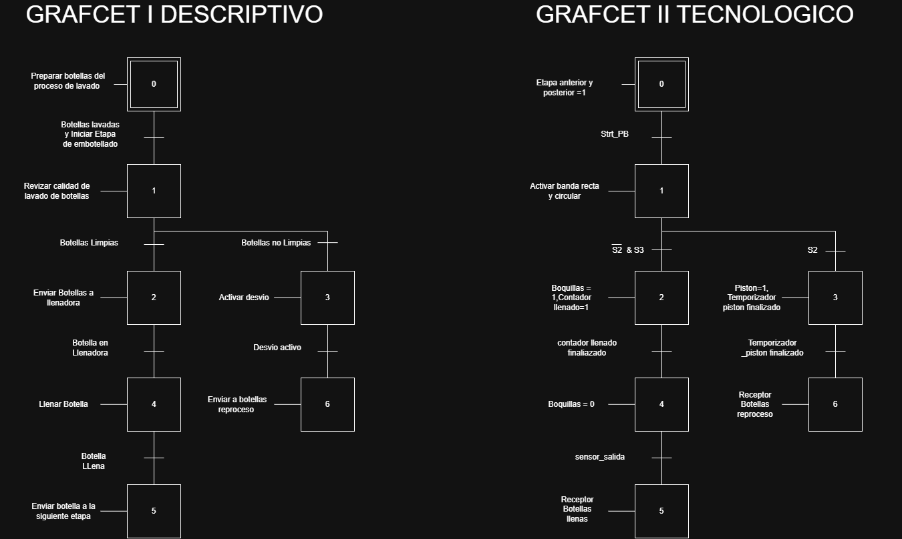
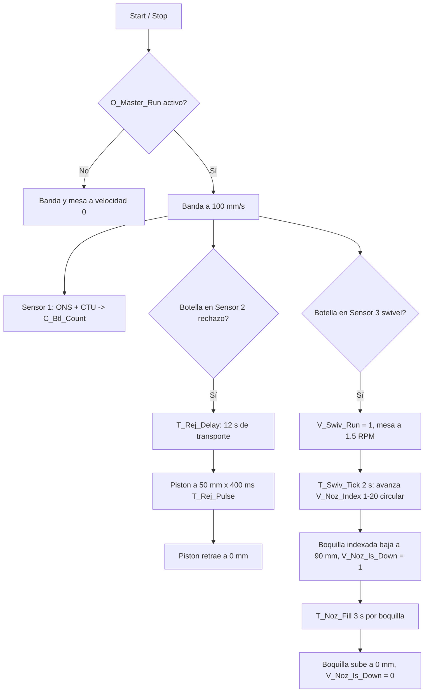

# Modulo 6 : Automatización discreta (PLC)

Este módulo documenta el programa de control discreto desarrollado en Studio 5000 (Logix Designer) para la estación de llenado rotativo (carrusel de 20 boquillas). El programa corre sobre un controlador virtual **Logix Emulate 5570** y sus salidas se envían al gemelo digital construido en Siemens NX presentado en el [Módulo 5](https://github.com/NicolasDavila2001/APM-20261S/tree/main/Modulo_5), conformando así el lazo entre la lógica de control y la simulación del carrusel y el rechazador. Para el desarrollo de las pantallas de supervisión sobre esta misma lógica(SCADA en Node-Red), se explica el [Módulo 7](https://github.com/NicolasDavila2001/APM-20261S/tree/main/Modulo_7).

## Grafcet descriptivo y tecnologico

## Descripción general del controlador

| Elemento | Valor |
| :--- | :--- |
| Controlador | Emulate 5570 (Studio 5000 Logix Emulate) |
| Tarea principal | `MainTask`, tipo Continuous, Watchdog 500 ms |
| Programa / Rutina | `MainProgram` → `MainRoutine` (Ladder Diagram, 54 rungs) |
| Integración | Entradas y salidas mapeadas al gemelo digital en NX (Módulo 5) |
| Archivo de proyecto | `APM_PROJECT.ACD` |

---

## Arquitectura de Inputs/Outputs y variables principales

### Entradas (sensores y mandos)

| Tag | Descripción |
| :--- | :--- |
| `I_Strt_PB` | Pulsador físico de arranque (Start) |
| `I_Stp_PB` | Pulsador físico de parada (Stop) |
| `I_NR_Stp` | Parada virtual enviada desde Node-RED |
| `I_Inf_Cnt_Sens` | Sensor 1: conteo de botellas a la entrada de la banda |
| `I_Rej_Sens` | Sensor 2: sensor óptico de la zona de rechazo |
| `I_Swv_Fill_Sens` | Sensor 3: presencia de botella a la entrada de la mesa circular (swivel) |

### Salidas (hacia el gemelo digital en NX)

| Tag | Descripción |
| :--- | :--- |
| `O_Master_Run` | Bit maestro de habilitación de la máquina |
| `O_Conv_Speed` | Velocidad de la banda (mm/s) |
| `O_Swiv_Speed` | Velocidad de giro de la mesa circular (RPM) |
| `O_Rej_Pos` | Posición del pistón de rechazo (mm) |
| `O_Noz_Vert_Pos[1..20]` | Altura de cada una de las 20 boquillas de llenado (mm) |

### Variables internas de control

| Tag | Descripción |
| :--- | :--- |
| `C_Btl_Count` | Contador de botellas totales procesadas |
| `ONS_Infeed` | Bit auxiliar de flanco (one-shot) para el conteo de entrada |
| `V_Swiv_Run` | Bit de giro de la mesa circular |
| `V_Noz_Index` | Índice (1 a 20) de la boquilla actualmente sobre el Sensor 3 |
| `V_Noz_Is_Down[1..20]` | Bandera: la boquilla N está abajo, llenando |
| `T_Rej_Delay` | Temporizador de movimiento de botella mala hasta el pistón (12 s) |
| `T_Rej_Pulse` | Duración de la extensión del pistón de rechazo (400 ms) |
| `T_Swiv_Tick` | Tiempo de avance de la mesa por boquilla, equivalente a 18° (2 s) |
| `T_Noz_Fill[1..20]` | Temporizador de llenado individual por boquilla (3 s) |

---

## Lógica de control

El programa se organiza en cinco bloques funcionales dentro de `MainRoutine`:

1. **Arranque y parada:** `I_Strt_PB` enclava `O_Master_Run`; `I_Stp_PB` o la parada virtual `I_NR_Stp` lo desenclavan.
2. **Consignas de actuadores:** con la máquina habilitada, se fijan 100 mm/s en la banda y 1.5 RPM en la mesa (si esta tiene permiso de giro); si la máquina se detiene, ambas velocidades se fuerzan a 0.
3. **Conteo de botellas:** cada flanco del Sensor 1 incrementa el contador `C_Btl_Count`.
4. **Estación de rechazo:** al detectar una botella defectuosa en el Sensor 2, se espera el tiempo de transporte (`T_Rej_Delay`, 12 s) hasta que llega al pistón, se extiende el pistón (`T_Rej_Pulse`, 400 ms) y se retrae.
5. **Carrusel e indexado de boquillas:** al detectar botella en el Sensor 3 se habilita el giro (`V_Swiv_Run`); cada 2 s (`T_Swiv_Tick`, un paso de 18°) avanza el índice `V_Noz_Index` de forma circular (1 a 20); la boquilla indexada baja y comienza su propio temporizador de llenado de 3 s (`T_Noz_Fill[N]`), tras el cual sube y libera la bandera `V_Noz_Is_Down[N]` para el siguiente ciclo.

> ***Nota*** Las 20 boquillas se implementan como 20 pares de rungs independientes (uno por boquilla) en lugar de un único bloque indexado, ya que el direccionamiento indirecto dentro de una instrucción de temporizador (`TON`) no es práctico en ladder. Solo la activación (bajar la boquilla) usa indexado dinámico sobre `V_Noz_Index`; el llenado y la subida de cada boquilla están codificados de forma individual.

---

## Parámetros de tiempo del proceso

| Temporizador | Valor | Significado |
| :--- | :--- | :--- |
| `T_Swiv_Tick` | 2 s | Avance de la mesa por boquilla (18° = 360°/20) |
| `T_Noz_Fill` | 3 s | Tiempo de llenado por boquilla |
| `T_Rej_Delay` | 12 s | Transporte de la botella mala hasta el pistón |
| `T_Rej_Pulse` | 400 ms | Duración del golpe del pistón de rechazo |

Con un avance de 2 s por boquilla y un llenado de 3 s, en régimen permanente hay simultáneamente más de una boquilla llenando a la vez (una nueva boquilla baja antes de que la anterior termine su llenado), lo cual es consistente con el comportamiento real de una llenadora rotativa descrito en el [Módulo 1](https://github.com/NicolasDavila2001/APM-20261S/tree/main/Modulo_1) y el [Módulo 2](https://github.com/NicolasDavila2001/APM-20261S/tree/main/Modulo_2).

## Referencias

- Reporte completo del proyecto en Studio 5000 (Controller Organizer, Tag Listing y Ladder Diagram): `Reporte_proyecto.pdf`.
- [Módulo 5 — Digital Factory](https://github.com/NicolasDavila2001/APM-20261S/tree/main/Modulo_5): gemelo digital en NX MCD que recibe las salidas de este programa.
- [Módulo 7 — SCADA y comunicaciones](https://github.com/NicolasDavila2001/APM-20261S/tree/main/Modulo_7): supervisión y HMI sobre esta misma lógica.
