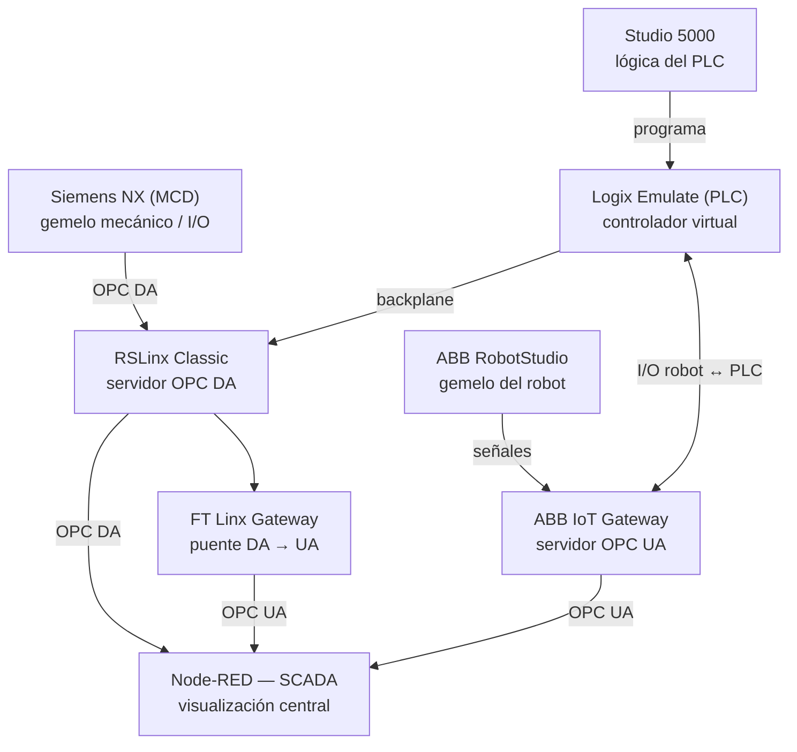

# Módulo 7 – SCADA y comunicaciones

## Arquitectura de comunicación del proyecto

Esta sección documenta cómo se interconectan los gemelos digitales y controladores
virtuales desarrollados en los módulos anteriores para llegar a una única plataforma
de visualización SCADA. No es un módulo aislado: reúne las comunicaciones de la celda
robotizada (Módulo 4), el gemelo digital en NX MCD (Módulo 5) y el PLC virtual en
Studio 5000 (Módulo 6).

### Componentes y rol de cada uno

| Componente | Rol | Módulo donde se desarrolla |
|---|---|---|
| Siemens NX (MCD) | Gemelo mecánico de la llenadora rotativa; envia/recibe señales de E/S | [Módulo 5](../Modulo_5/Readme.md) |
| Studio 5000 | Programación ladder del PLC de la llenadora | [Módulo 6](../Modulo_6/Readme.md) |
| Logix Emulate | Controlador virtual que ejecuta el programa de Studio 5000 | Módulo 6 |
| ABB RobotStudio | Gemelo del robot paletizador IRB 660 | [Módulo 4](../Modulo_4/Readme.md) |
| ABB IoT Gateway | Servidor OPC UA que expone las señales del robot | Módulo 4 / Módulo 7 |
| RSLinx Classic | Servidor OPC DA; puente entre el controlador virtual y NX MCD | Módulo 7 |
| FT Linx Gateway | Puente que traduce OPC DA → OPC UA para unificar ambos protocolos | Módulo 7 |
| Node-RED (SCADA) | Nodo central de visualización; recibe OPC DA (línea de llenado) y OPC UA (celda robotizada) | Módulo 7 |

### Flujo de datos

- **Studio 5000 → Logix Emulate**: se descarga el programa ladder al controlador virtual.
- **Logix Emulate ↔ RSLinx Classic**: comunicación por backplane virtual; RSLinx expone las
  tags del PLC como servidor OPC DA.
- **NX MCD ↔ RSLinx Classic**: el gemelo digital de la llenadora lee/escribe esas mismas
  tags vía OPC DA (ver tabla de señales detallada en el [Módulo 5](../Modulo_5/Readme.md)).
- **ABB RobotStudio → ABB IoT Gateway**: el gemelo del robot envía sus señales de E/S,
  expuestas como servidor OPC UA.
- **Logix Emulate ↔ ABB IoT Gateway**: intercambio de señales I/O robot–PLC para
  sincronizar la celda robotizada con la línea de llenado.
- **RSLinx Classic → FT Linx Gateway → Node-RED**: las tags OPC DA de la línea de llenado
  llegan al SCADA convertidas a OPC UA.
- **ABB IoT Gateway → Node-RED**: las señales del robot llegan directamente por OPC UA.

De esta forma, Node-RED centraliza en una sola interfaz SCADA tanto el estado de la
línea de llenado (vía NX MCD/Studio 5000) como el de la celda robotizada (vía
RobotStudio), aunque cada sistema use un protocolo distinto en su origen (OPC DA vs. OPC UA).
