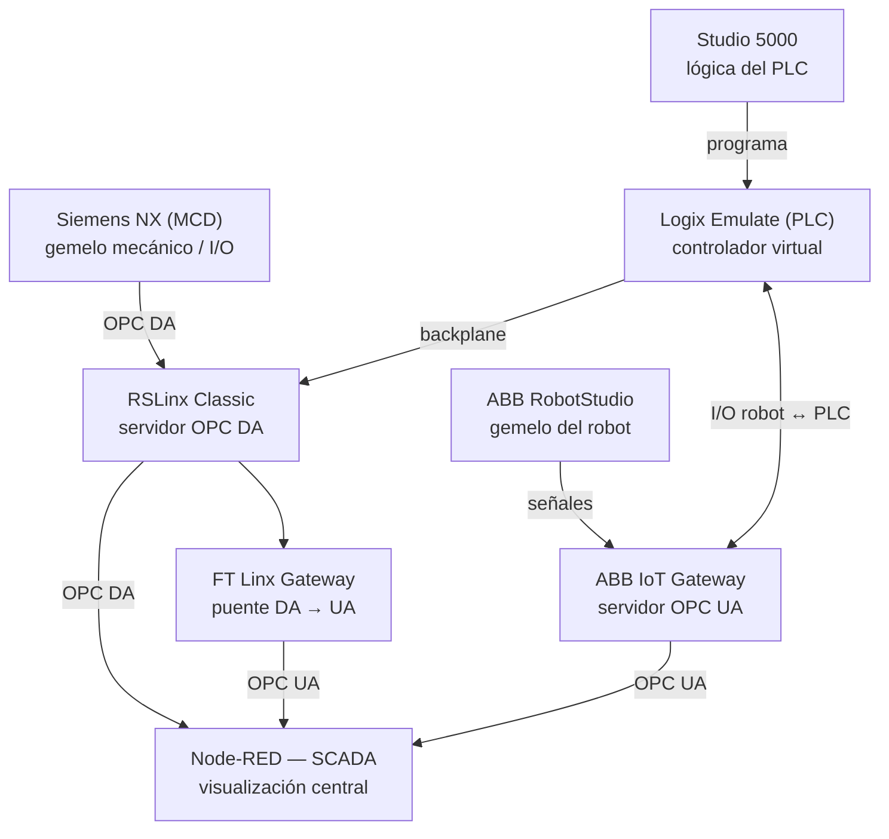

# Módulo 7 – SCADA y comunicaciones

## Arquitectura de comunicación del proyecto

Esta sección documenta cómo se interconectan los gemelos digitales y controladores
virtuales desarrollados en los módulos anteriores para llegar a una única plataforma
de visualización SCADA. No es un módulo aislado: reúne las comunicaciones de la celda
robotizada (Módulo 4), el gemelo digital en NX MCD (Módulo 5) y el PLC virtual en
Studio 5000 (Módulo 6).

### Componentes y rol de cada uno

| Componente | Rol | Módulo donde se desarrolla |
|---|---|---|
| Siemens NX (MCD) | Gemelo mecánico de la llenadora rotativa; envia/recibe señales de E/S | [Módulo 5](../Modulo_5/Readme.md) |
| Studio 5000 | Programación ladder del PLC de la llenadora | [Módulo 6](../Modulo_6/Readme.md) |
| Logix Emulate | Controlador virtual que ejecuta el programa de Studio 5000 | Módulo 6 |
| ABB RobotStudio | Gemelo del robot paletizador IRB 660 | [Módulo 4](../Modulo_4/Readme.md) |
| ABB IoT Gateway | Servidor OPC UA que expone las señales del robot | Módulo 4 / Módulo 7 |
| RSLinx Classic | Servidor OPC DA; puente entre el controlador virtual y NX MCD | Módulo 7 |
| FT Linx Gateway | Puente que traduce OPC DA → OPC UA para unificar ambos protocolos | Módulo 7 |
| Node-RED (SCADA) | Nodo central de visualización; recibe OPC DA (línea de llenado) y OPC UA (celda robotizada) | Módulo 7 |

### Flujo de datos

- **Studio 5000 → Logix Emulate**: se descarga el programa ladder al controlador virtual.
- **Logix Emulate ↔ RSLinx Classic**: comunicación por backplane virtual; RSLinx expone las
  tags del PLC como servidor OPC DA.
- **NX MCD ↔ RSLinx Classic**: el gemelo digital de la llenadora lee/escribe esas mismas
  tags vía OPC DA (ver tabla de señales detallada en el [Módulo 5](../Modulo_5/Readme.md)).
- **ABB RobotStudio → ABB IoT Gateway**: el gemelo del robot envía sus señales de E/S,
  expuestas como servidor OPC UA.
- **Logix Emulate ↔ ABB IoT Gateway**: intercambio de señales I/O robot–PLC para
  sincronizar la celda robotizada con la línea de llenado.
- **RSLinx Classic → FT Linx Gateway → Node-RED**: las tags OPC DA de la línea de llenado
  llegan al SCADA convertidas a OPC UA.
- **ABB IoT Gateway → Node-RED**: las señales del robot llegan directamente por OPC UA.

De esta forma, Node-RED centraliza en una sola interfaz SCADA tanto el estado de la
línea de llenado (vía NX MCD/Studio 5000) como el de la celda robotizada (vía
RobotStudio), aunque cada sistema use un protocolo distinto en su origen (OPC DA vs. OPC UA).

---

## Desarrollo del SCADA (Node-RED)

Dentro de la arquitectura general descrita arriba, esta sección detalla el trabajo
realizado específicamente en **Node-RED** para supervisar y controlar la etapa de
**Llenado (carrusel rotativo)**: un carrusel de 20 boquillas, una banda transportadora
de entrada recta y un mecanismo de rechazo de botellas. El editor de Node-RED se
trabajó siempre desde el navegador (sin edición directa de archivos de código), sobre
Windows.

### 1. Conexión con el controlador virtual (CIP / EtherNet-IP)

La comunicación entre Node-RED y el PLC virtual (Logix Emulate + RSLinx Classic) se
estableció mediante la paleta **`node-red-contrib-cip-ethernet-ip`**, que implementa el
protocolo CIP sobre EtherNet-IP:

- Se configuró un nodo **ETH-IP In** apuntando a la IP del controlador virtual, con el
  modo de lectura en **"all tags"**, de forma que todas
  las tags del PLC llegan agrupadas en un único mensaje por ciclo de escaneo.
- Para extraer valores de tags con notación de punto (por ejemplo `C_Btl_Count.ACC`,
  el valor acumulado del contador de botellas), se usaron expresiones **JSONata** con
  la función `$lookup(payload, "C_Btl_Count.ACC")`, evitando el uso de comillas
  invertidas (backticks) que provocaban corrupción de caracteres en el nombre de la tag.
- Un nodo **ETH-IP Out** permite escribir tags de control hacia el PLC (por ejemplo,
  el arranque del sistema).

### 2. Supervisión de sensores y actuadores

Cumpliendo el requerimiento de supervisar la totalidad de sensores y actuadores, se mapearon en el dashboard las tags provenientes del programa
ladder de Studio 5000, entre ellas:

| Tag del PLC | Elemento físico / función | Uso en el SCADA |
|---|---|---|
| `I_Strt_PB` | Pulsador de arranque de la línea | Reutilizada como botón de **Start** del SCADA (control, no solo lectura) |
| `O_Rej_Pos` | Posición del actuador de rechazo | Supervisión de solo lectura en el dashboard |
| `C_Btl_Count.ACC` | Valor acumulado del contador de botellas procesadas por el carrusel | Fuente directa del conteo de **botellas procesadas** (sin recontar en Node-RED) |
| Sensores de banda de entrada y boquillas del carrusel | Detección de botellas / posición del carrusel | Indicadores de estado en el dashboard |
| Actuador/mecanismo de rechazo | Expulsión de botellas no conformes | Supervisión y conteo de **botellas rechazadas** |

El valor de `C_Btl_Count.ACC` se lee directamente desde el PLC en lugar de reimplementar
un contador en Node-RED, evitando duplicidad e inconsistencias entre el conteo del PLC
y el del SCADA.

### 3. Control Arranque y Parada desde el SCADA

El dashboard incluye control de arranque y parada de la línea, reutilizando el tag
`I_Strt_PB` ya existente en el programa del PLC en lugar de crear un tag nuevo. Los
botones de control del dashboard se implementaron con nodos **`ui-template`** siguiendo
el patrón de Vue `@click="send(...)"`, consistente en toda la interfaz para los
elementos interactivos.

### 4. Alarmas

Se configuraron alarmas asociadas a condiciones críticas del proceso de llenado (por
ejemplo, detención no esperada del carrusel y activación sostenida del mecanismo de
rechazo).

### 5. Registro histórico (CSV logger)

Para el registro de los históricos, se implementó un
**logger en CSV** que registra en cada ciclo:

- `procesadas`: botellas procesadas, tomadas de `C_Btl_Count.ACC` a través del nodo
  **`CONTADOR BOTELLAS PROCESADAS`**.
- `rechazadas`: botellas rechazadas, tomadas de `flow.contadorRechazadas` a través del
  nodo **`CONTADOR RECHAZO`**.
- `tiempoCorriendo` y `tiempoPlaneado`: tiempos usados posteriormente para el cálculo de
  OEE.

El archivo histórico se guarda en local.

### 6. Analítica de OEE (Python + pandas)

Sobre el histórico anterior se construyó un pipeline de análisis:

- Un nodo **`exec`** en Node-RED invoca un script de Python (`analisis.py`) alojado en local.

- El script usa **pandas** para calcular, a partir del CSV histórico, los tres
  componentes clásicos del OEE:
  - **Disponibilidad** = tiempo corriendo / tiempo planeado.
  - **Rendimiento** = comparación entre el ciclo real y el **tiempo de ciclo ideal**
    (`IDEAL_CYCLE_TIME_SEC`).
  - **Calidad** = proporción de botellas procesadas frente al total (procesadas +
    rechazadas).
  - **OEE** = Disponibilidad × Rendimiento × Calidad.
- Un nodo **`trigger`** llamado **`AUTO TRIGGER ANALISIS`** dispara la ejecución del
  script automáticamente cada 5–8 segundos, y el resultado en JSON se guarda en
  `flow.get('ultimoAnalisis')` para su reutilización sin tener que recalcular en cada
  petición.
- Nota de arquitectura: el OEE se calcula **por etapa**, no para la línea completa, ya
  que cada etapa del proceso tiene su propio tiempo de ciclo ideal; un único número de
  OEE de línea no sería representativo.

### 7. Dashboard (Node-RED Dashboard 2.0)

La visualización se construyó sobre **Dashboard 2.0** (`@flowfuse/node-red-dashboard`),
con un tema claro y una paleta de colores consistente:

- Fondo blanco.
- Azul `#0284c7` para valores e indicadores normales.
- Rojo `#dc2626` para alarmas/estados críticos.
- Ámbar `#d97706` para estados de advertencia.

Las tarjetas de KPI (Disponibilidad, Rendimiento, Calidad, OEE, botellas procesadas y
rechazadas) se implementaron con nodos **`ui-template`** personalizados en lugar de los
widgets estándar, para tener control total sobre el estilo visual.

Adicionalmente, se incorporó un nodo de función **`REINICIAR CONTADORES`** (con tres
salidas) que reinicia simultáneamente las tarjetas de KPI, las variables de flujo
usadas en el cálculo de OEE y los estados internos de los contadores, permitiendo
reiniciar una corrida de prueba sin recargar todo el flujo.

### 8. Integración con el MES/ERP (endpoint HTTP)

Para que el sistema MES/ERP  pueda consumir los datos de producción de esta etapa, se expuso un **endpoint HTTP GET** en
`/api/oee`:

- Responde con el último análisis de OEE calculado, tomado de `flow.get('ultimoAnalisis')`.
- Este valor se mantiene actualizado en segundo plano por el trigger `AUTO TRIGGER
  ANALISIS` (cada 5–8 segundos), por lo que el endpoint responde de inmediato con el
  dato más reciente ya calculado, sin recalcular en cada llamada.
- El endpoint es de tipo **solicitud–respuesta** (no *streaming*/push), por lo que el
  sistema MES/ERP debe consultarlo periódicamente (*polling*) para mantenerse
  sincronizado.
- La disponibilidad del endpoint se validó dentro de la misma red local (LAN) en la que
  corre Node-RED.

### 9. Acceso remoto (Remote-RED)

Para el acceso remoto del SCADA, se instaló la paleta
**`node-red-contrib-remote`**, que permite exponer el dashboard de Node-RED fuera de la
red local. El acceso remoto se validó exitosamente desde un teléfono móvil conectado
por **datos celulares (5G)**, confirmando que el dashboard y sus controles (incluyendo
Start/Stop) son accesibles sin depender de la red WiFi local.
