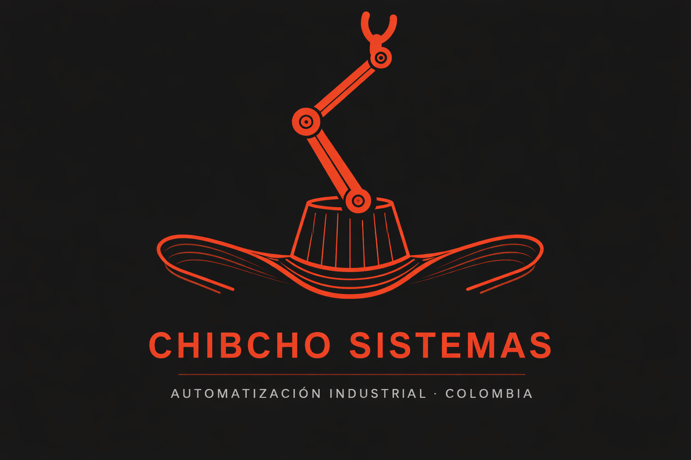
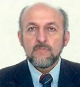

# Proyecto Integrador Chibcho Sistemas
## Automatización de Procesos de Manufactura (2026-1)

  

  

## 🔍Quienes Somos?

En *** somos una empresa especializada en el desarrollo de soluciones integrales de automatización industrial, enfocadas en transformar y optimizar procesos de manufactura mediante el uso de tecnologías avanzadas. Nuestro equipo combina conocimientos en control industrial, robótica, simulación y analítica de datos para diseñar sistemas eficientes, flexibles y escalables. Acompañamos a nuestros clientes en cada etapa del proceso, desde el análisis y diseño hasta la implementación y validación, garantizando mejoras significativas en productividad, calidad y competitividad dentro de un entorno alineado con los principios de la Industria 4.0.
## 🫂Equipo de trabajo 
<table>
  <tr>
    <td align="center">
       
      <b>Nicolas Fernando Davila Peñuela</b> 
      Ingeniero Mecatronico - 
    </td>
    <td align="center">
       
      <b>Juan David Meza Criollo</b> 
      Ingeniero Mecatronico -
    </td>
    <td align="center">
       
      <b>Cristian Fabián Martínez Bohorquez</b> 
      Ingeniero Mecatronico -
    </td>
  </tr>
  <tr>
    <td align="center">
       
      <b>Andres Mauricio Avilan Herrera</b> 
      Ingeniero Mecatronico -
    </td>
    <td align="center">
       
      <b>Santiago Avila Corredor</b> 
      Ingeniero Mecatronico - 
    </td>
    <td align="center">
       
      <b>Juan José Delgado Estrada </b> 
      Ingeniero Mecatronico - 
    </td>
  </tr>
</table>
## 🦾Nuestros Expertos 
<table>
  <tr>
    <td align="center">
       
      <b>Luis Miguel Méndez M.</b> 
      Dr.-Ing.|Ingeniería Mecánica, Biomecánica & PrecisiónMantenimiento Hospitalario |HVAC · Máquinas Térmicas & Hidráulicas |Docente UNAL
    </td>
    <td align="center">
       
      <b>Carlos Julio Cortés R.</b> 
      Dr.-Ing|Ingeniería Mecánica-Biomecánica-Precisión-Fabricación|Docente UNAL
    </td>
    <td align="center">
       
      <b>Ubaldo García Zaragoza</b> 
      Ing. Mecánico | Lic. Innovación & Diseño | Concepto a Prototipo Validación | PLM Producción alto volumen|Docente UNAL
    </td>
  </tr>
  <tr>
    <td align="center">
       
      <b>Ricardo Ramirez H.</b> 
      Ing. Mecánico & Electrónico | MSc. Automatización Industrial | PhD. Ciencias de Ingeniería Mecánica|Docente UNAL 
    </td>
    <td align="center">
       
      <b>Víctor Hugo Grisales P.</b> 
      PhD. Mecatrónica, Robótica & Automatización| PhD. Sistemas Automáticos | Consultor Senior |Docente UNAL
    </td>
    <td align="center">
       
      <b>Eduardo Barrera Gualdron</b> 
      Ing. Electrónico | MSc. Control · Beijing · China | Automatización & SCADA |Docente UNAL  
    </td>
  </tr>
</table>

## 🏭Proyecto planta de producción de bebidas 

Este proyecto consiste en el diseño e implementación de una planta automatizada para la producción de bebidas, orientada a mejorar los índices de desempeño de la planta actual mediante la integración de diferentes etapas del proceso, como el procesamiento, llenado, empaque y despacho. La solución propone el uso de tecnologías industriales como PLC, sistemas SCADA, celdas robotizadas y simulación digital, con el fin de optimizar la eficiencia operativa, garantizar la calidad del producto y fortalecer la toma de decisiones en el proceso productivo.

## 📑 Requerimientos del proyecto 
Línea de alto volumen con mínimo **3 productos diferentes**

  
| Tipo de Envase | Volumen |
|---|---|
| Bajo volumen | 150 – 600 mL |
| Medio volumen | 1 – 3 L |
| Gran volumen (Garrafones) | 12 o 20 L |

| Aspecto de Diferenciación |
|---|
| Capacidad y geometría del envase |
| Sabores o ingredientes |
| Velocidad de producción |
| Secuencia lógica de operación |
| Estrategia de inspección y calidad |
| Trazabilidad y toma de decisiones |

> Los productos deben diferenciarse en al menos dos aspectos de la tabla anterior.

## 🗂️Modulos del Proyecto

- [Modulo 1: Introducción a la automatización de manufactura ](https://github.com/NicolasDavila2001/APM-20261S/tree/main/Modulo_1/)
- [Modulo 2: Gestión de producción ](https://github.com/NicolasDavila2001/APM-20261S/tree/main/Modulo_2/)
- [Modulo 3: Planeación de proyectos](https://github.com/NicolasDavila2001/APM-20261S/tree/main/Modulo_3/)
- [Modulo 4: Celdas robotizadas de manufactura](https://github.com/NicolasDavila2001/APM-20261S/tree/main/Modulo_4/)
- [Modulo 5: Digital factory](https://github.com/NicolasDavila2001/APM-20261S/tree/main/Modulo_5/)
- [Modulo 6: Automatización discreta (PLC)](https://github.com/NicolasDavila2001/APM-20261S/tree/main/Modulo_6/)
- [Modulo 7: SCADA y comunicaciones](https://github.com/NicolasDavila2001/APM-20261S/tree/main/Modulo_7/)
- [Resultados](https://github.com/NicolasDavila2001/APM-20261S/tree/main/Resultados/)

## 💾Anexos 
 - [Pagina web](https://nicolasdavila2001.github.io/APM-20261S/)
 - [Drive](https://drive.google.com/drive/folders/1QVZhY7u8GsLHCyEWJAowoTUEtw_0oujM?usp=drive_link)
 - [Presentaciones](https://drive.google.com/drive/folders/1rmt_XTF3Gyx2ZOrqQg3J9glDm1CesLqV?usp=sharing)
