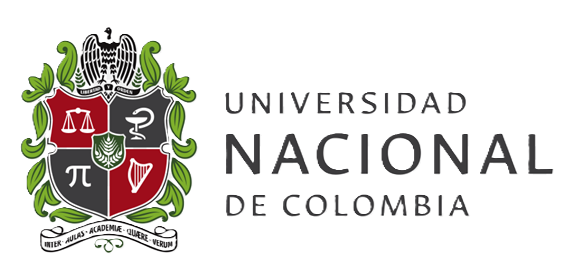
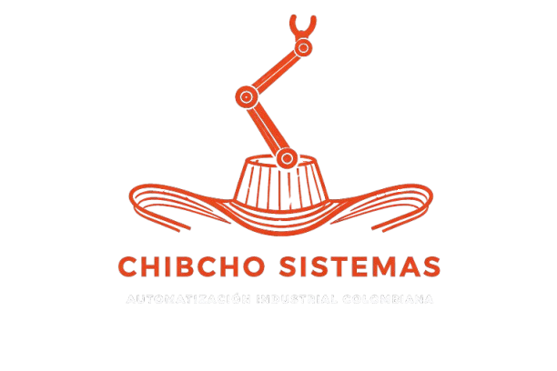
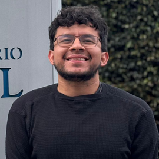
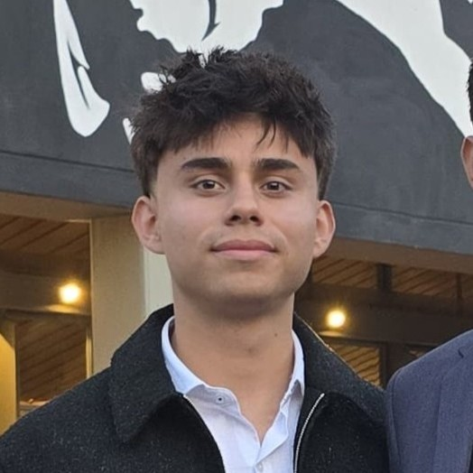
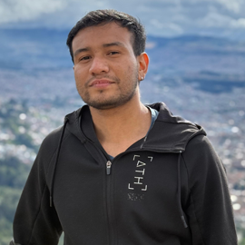
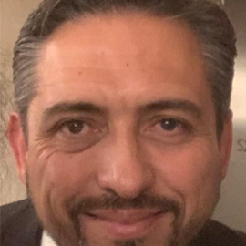
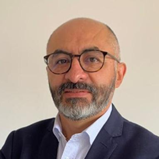
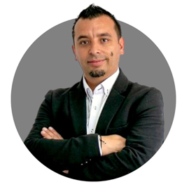
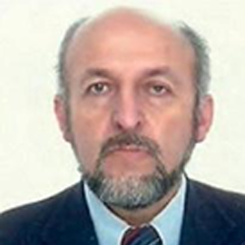
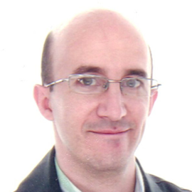

# Proyecto Integrador Chibcho Sistemas
## Automatización de Procesos de Manufactura (2026-1)

  
  &nbsp;&nbsp;&nbsp;&nbsp;&nbsp;
  

## 🔍Quienes Somos?

En Chibcho sistemas somos una empresa especializada en el desarrollo de soluciones integrales de automatización industrial, enfocadas en transformar y optimizar procesos de manufactura mediante el uso de tecnologías avanzadas. Nuestro equipo combina conocimientos en control industrial, robótica, simulación y analítica de datos para diseñar sistemas eficientes, flexibles y escalables. Acompañamos a nuestros clientes en cada etapa del proceso, desde el análisis y diseño hasta la implementación y validación, garantizando mejoras significativas en productividad, calidad y competitividad dentro de un entorno alineado con los principios de la Industria 4.0.
## 🫂Equipo de trabajo 
<table>
  <tr>
    <td align="center">
       
      <b>Nicolas Fernando Davila Peñuela</b> 
      Ingeniero Mecatronico - CEO 
    </td>
    <td align="center">
       
      <b>Juan David Meza Criollo</b> 
      Ingeniero Mecatronico - CIO 
    </td>
    <td align="center">
       
      <b>Cristian Fabián Martínez Bohorquez</b> 
      Ingeniero Mecatronico - CCO
    </td>
  </tr>
  <tr>
    <td align="center">
       
      <b>Andres Mauricio Avilan Herrera</b> 
      Ingeniero Mecatronico - CFO 
    </td>
    <td align="center">
       
      <b>Santiago Avila Corredor</b> 
      Ingeniero Mecatronico - CTO 
    </td>
    <td align="center">
       
      <b>Juan José Delgado Estrada </b> 
      Ingeniero Mecatronico - COO 
    </td>
  </tr>
</table>

## 🦾Nuestros Expertos 
<table>
  <tr>
    <td align="center">
       
      <b>Luis Miguel Méndez M.</b> 
      Dr.-Ing.|Ingeniería Mecánica, Biomecánica & PrecisiónMantenimiento Hospitalario |HVAC · Máquinas Térmicas & Hidráulicas |Docente UNAL
    </td>
    <td align="center">
       
      <b>Carlos Julio Cortés R.</b> 
      Dr.-Ing|Ingeniería Mecánica-Biomecánica-Precisión-Fabricación|Docente UNAL
    </td>
    <td align="center">
       
      <b>Ubaldo García Zaragoza</b> 
      Ing. Mecánico | Lic. Innovación & Diseño | Concepto a Prototipo Validación | PLM Producción alto volumen|Docente UNAL
    </td>
  </tr>
  <tr>
    <td align="center">
       
      <b>Ricardo Ramirez H.</b> 
      Ing. Mecánico & Electrónico | MSc. Automatización Industrial | PhD. Ciencias de Ingeniería Mecánica|Docente UNAL 
    </td>
    <td align="center">
       
      <b>Víctor Hugo Grisales P.</b> 
      PhD. Mecatrónica, Robótica & Automatización| PhD. Sistemas Automáticos | Consultor Senior |Docente UNAL
    </td>
    <td align="center">
       
      <b>Eduardo Barrera Gualdron</b> 
      Ing. Electrónico | MSc. Control · Beijing · China | Automatización & SCADA |Docente UNAL  
    </td>
  </tr>
</table>

## 🏭Proyecto planta de producción de bebidas 

Este proyecto consiste en el diseño e implementación de una planta automatizada para la producción de bebidas, orientada a mejorar los índices de desempeño de la planta actual mediante la integración de diferentes etapas del proceso, como el procesamiento, llenado, empaque y despacho. La solución propone el uso de tecnologías industriales como PLC, sistemas SCADA, celdas robotizadas y simulación digital, con el fin de optimizar la eficiencia operativa, garantizar la calidad del producto y fortalecer la toma de decisiones en el proceso productivo.

## 📑 Requerimientos del proyecto 
Línea de alto volumen con mínimo **3 productos diferentes**

  
| Tipo de Envase | Volumen |
|---|---|
| Bajo volumen | 150 – 600 mL |
| Medio volumen | 1 – 3 L |
| Gran volumen (Garrafones) | 12 o 20 L |

| Aspecto de Diferenciación |
|---|
| Capacidad y geometría del envase |
| Sabores o ingredientes |
| Velocidad de producción |
| Secuencia lógica de operación |
| Estrategia de inspección y calidad |
| Trazabilidad y toma de decisiones |

> Los productos deben diferenciarse en al menos dos aspectos de la tabla anterior.

## 🗂️Modulos del Proyecto

- [Modulo 1: Introducción a la automatización de manufactura ](Modulo_1)
- [Modulo 2: Gestión de producción ](Modulo_2)
- [Modulo 3: Planeación de proyectos](Modulo_3)
- [Modulo 4: Celdas robotizadas de manufactura](Modulo_4)
- [Modulo 5: Digital factory](Modulo_5)
- [Modulo 6: Automatización discreta (PLC)](Modulo_6)
- [Modulo 7: SCADA y comunicaciones](Modulo_7)
- [Resultados -  Propuesta de automatización](Resultados)
- [Reflexiones y Aportes](#Reflexiones-y-aportes)

## 🤔 Reflexciones y Aportes
## 1. Gestión de Proyecto

**La planeación como columna vertebral de la operación**

Para nosotros, abordar la automatización de una planta de bebidas no fue solo un reto técnico, sino un ejercicio profundo de gestión. Desde el inicio, el proyecto nos obligó a ver más allá de los diagramas de control y los PLCs; tuvimos que entender que estábamos simulando la "columna vertebral" de una operación productiva. 

Al principio, nuestras reuniones carecían de la estructura necesaria y, al igual que una línea de producción mal sincronizada, los esfuerzos no rendían al máximo. Sin embargo, comprendimos como equipo que la gestión de un proyecto no se trata de reunirse por reunirse, sino de sincronizar talentos y tiempos para mantener el flujo constante de trabajo. Nos costó encontrar ese ritmo, pero cuando lo logramos, todo empezó a fluir mejor.

Aprendimos juntos a gestionar la ambigüedad. Hubo semanas donde el avance era tan fluido como el llenado de botellas, y otras donde tuvimos que detenernos a "hacer mantenimiento" de tareas que no quedaron claras. Fue en esas pausas donde maduramos como equipo, entendiendo que la priorización de recursos no es un acto de limitación, sino de inteligencia estratégica. Nos dimos cuenta de que no siempre se puede tener todo lo que se quiere, pero sí se puede hacer mucho con lo que se tiene.

Al no contar con las herramientas ideales, nos vimos en la necesidad de innovar con lo que teníamos, una habilidad que sabemos será crucial en el mundo real, donde los presupuestos y los tiempos siempre son ajustados. La interacción con los docentes fue nuestro principal "sensor de calidad"; aunque sus correcciones a veces fueron inesperadas, nos ayudaron a recalibrar el rumbo y a tomar decisiones más acertadas. Como grupo entendimos que un buen proyecto no es el que nunca se equivoca, sino el que sabe corregir a tiempo y aprender de cada desviación.

---

## 2. Trabajo Colaborativo

**Del trabajo en equipo al liderazgo compartido**

Automatizar una planta de bebidas es un desafío que, por su naturaleza multidisciplinaria, no puede recaer en una sola persona. Desde el primer día, dividimos roles buscando aprovechar las fortalezas individuales de cada integrante, pero la verdadera lección llegó cuando entendimos que los roles son solo un punto de partida. 

En la práctica, el éxito del proyecto dependió de nuestra capacidad para apoyarnos mutuamente cuando alguien se atascaba. Hubo momentos de mucha sinergia, donde las ideas fluían y los avances se multiplicaban, pero también hubo otros donde el trabajo se estancaba y la comunicación se volvía crítica. Fue en esos momentos donde el equipo demostró su madurez, porque en lugar de señalar culpables, nos sentamos a resolver los cuellos de botella como un solo grupo.

El trabajo colaborativo se hizo evidente en cada entregable: desde los documentos compartidos hasta las simulaciones que requerían unir esfuerzos entre varios. Aprendimos que la colaboración real no es hacer todo juntos, sino confiar en que cada uno hará su parte y estar listo para tender un puente cuando el otro lo necesite. Las asesorías con los docentes reforzaron esta dinámica, porque salíamos de ellas con tareas claras y con el compromiso de resolverlas en conjunto, repartiéndolas de manera equitativa y estratégica.

Si algo nos llevamos de esta experiencia es que la ingeniería no se hace en solitario. Así como una planta de bebidas depende de cada válvula, motor y sensor funcionando en armonía, un proyecto exitoso depende de que cada persona sepa cuándo liderar, cuándo seguir y cuándo dar una mano sin que se lo pidan. Hoy podemos decir que, más allá del resultado técnico, el mayor logro fue construir una dinámica de equipo que funcionó, con más altos que bajos, y que nos dejó una experiencia valiosa para nuestra vida profesional.

## 💾Anexos 
 - [Pagina web](https://nicolasdavila2001.github.io/APM-20261S/)
 - [Drive](https://drive.google.com/drive/folders/1QVZhY7u8GsLHCyEWJAowoTUEtw_0oujM?usp=drive_link)
 - [Presentaciones](https://drive.google.com/drive/folders/1rmt_XTF3Gyx2ZOrqQg3J9glDm1CesLqV?usp=sharing)
 - [Video sustentación intermedia](https://www.youtube.com/watch?v=L1uTU9dJ8d0)
 - [Video sustentación final](https://www.youtube.com/watch?v=L1uTU9dJ8d0](https://www.youtube.com/watch?v=nFEx-Cs9Hqw))

